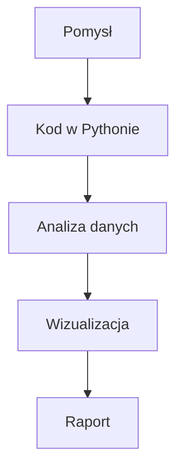

# L01 — Ćwiczenia laboratoryjne

## Temat: Konfiguracja warsztatu pracy analityka danych

**Programowanie w Pythonie II** | Laboratorium 1
**Czas:** 90 min | **Forma:** ćwiczenia praktyczne

---

## Ćwiczenie 1: Instalacja narzędzi (20 min)

### Cel
Zainstaluj i skonfiguruj narzędzia, z których będziesz korzystać przez cały semestr.

### Krok 1 — Python

**Linux (Ubuntu/Debian):**
```bash
sudo apt update && sudo apt install python3 python3-pip python3-venv
python3 --version
```

**Windows:**
1. Pobierz Python z https://www.python.org/downloads/
2. **WAŻNE:** Zaznacz ✅ "Add Python to PATH" przy instalacji
3. Otwórz PowerShell i sprawdź:
```powershell
python --version
```

**macOS:**
```bash
brew install python
python3 --version
```

### Krok 2 — uv (menedżer pakietów)

**Linux/macOS:**
```bash
curl -LsSf https://astral.sh/uv/install.sh | sh
```

**Windows (PowerShell):**
```powershell
powershell -ExecutionPolicy ByPass -c "irm https://astral.sh/uv/install.ps1 | iex"
```

Zamknij i otwórz terminal ponownie, potem sprawdź:
```bash
uv --version
```

### Krok 3 — Git

**Linux:**
```bash
sudo apt install git
```

**Windows:** Pobierz z https://git-scm.com/download/win (domyślne ustawienia).

**macOS:**
```bash
brew install git
```

Sprawdź:
```bash
git --version
```

### Krok 4 — VS Code

1. Pobierz z https://code.visualstudio.com/
2. Zainstaluj
3. Otwórz VS Code i zainstaluj rozszerzenia:
   - **Python** (Microsoft)
   - **Jupyter** (Microsoft)
   - **GitLens** (GitKraken)

Jak zainstalować rozszerzenie: `Ctrl+Shift+X` → wpisz nazwę → kliknij "Install"

### Sprawdzenie ✅

Uruchom w terminalu (VS Code: `` Ctrl+` `` otwiera terminal):
```bash
python3 --version
uv --version
git --version
code --version
```

Wszystkie 4 komendy muszą zwrócić numer wersji. Jeśli coś nie działa — zgłoś prowadzącemu.

---

## Ćwiczenie 2: Git — pierwsze repozytorium (20 min)

### Cel
Stwórz lokalne repozytorium Git, wykonaj pierwszy commit i wypchnij na GitHub.

### Krok 1 — Konfiguracja Git (jednorazowo)

```bash
git config --global user.name "Twoje Imię Nazwisko"
git config --global user.email "twoj.email@example.com"
```

### Krok 2 — Konto GitHub

Jeśli nie masz: wejdź na https://github.com → **Sign up** → załóż konto.

### Krok 3 — Utwórz lokalne repozytorium

```bash
mkdir python2-lab
cd python2-lab
git init
```

### Krok 4 — Pierwszy plik i commit

```bash
echo "# Moje laboratorium Python II" > README.md
git add README.md
git commit -m "Pierwszy commit — dodaj README"
```

**Co się stało:**
- `git init` — utworzył repozytorium (ukryty folder `.git/`)
- `git add` — dodał plik do "poczekalni" (staging area)
- `git commit` — zapisał migawkę z opisem

### Krok 5 — Wypchnij na GitHub

1. Na GitHub: kliknij **+** → **New repository**
2. Nazwa: `python2-lab`, reszta domyślnie → **Create repository**
3. W terminalu:

```bash
git remote add origin https://github.com/TWÓJ-LOGIN/python2-lab.git
git push -u origin master
```

4. GitHub zapyta o dane logowania:
   - Login: twój login GitHub
   - Hasło: **NIE zwykłe hasło!** Potrzebujesz **token**:
     - GitHub → Settings → Developer settings → Personal access tokens → Tokens (classic)
     - Generate new token → zaznacz `repo` → Generate → skopiuj token
     - Wklej token zamiast hasła

### Sprawdzenie ✅

Otwórz w przeglądarce: `https://github.com/TWÓJ-LOGIN/python2-lab`

Widzisz swoje README.md? Gratulacje — masz pierwsze repozytorium!

---

## Ćwiczenie 3: Markdown — napisz o sobie (20 min)

### Cel
Napisz profesjonalne README.md w składni Markdown. To będzie wizytówka twojego repozytorium.

### Krok 1 — Otwórz README.md w VS Code

```bash
code README.md
```

### Krok 2 — Włącz podgląd Markdown

W VS Code: `Ctrl+Shift+V` (podgląd) lub `Ctrl+K V` (podgląd obok kodu).

### Krok 3 — Napisz o sobie

Użyj tego szablonu i uzupełnij swoimi danymi:

```markdown
# Imię Nazwisko

## O mnie
Studiuję Analitykę danych w biznesie na Politechnice Opolskiej, semestr 2.

## Zainteresowania
- [wpisz coś]
- [wpisz coś]
- [wpisz coś]

## Umiejętności techniczne
| Narzędzie | Poziom |
|-----------|--------|
| Python    | początkujący / średni |
| Excel     | ... |
| SQL       | ... |

## Czego chcę się nauczyć
1. [wpisz cel]
2. [wpisz cel]
3. [wpisz cel]

## Kontakt
- GitHub: [twój login](https://github.com/twój-login)
- Email: twój.email@example.com
```

### Krok 4 — Zapisz, commituj i wypchnij

```bash
git add README.md
git commit -m "Rozbuduj README o opis osobisty"
git push
```

### Krok 5 — Sprawdź na GitHubie

Odśwież stronę repozytorium — twoje README powinno wyglądać pięknie sformatowane.

### Bonus: Diagram Mermaid

Dodaj na końcu README:

````markdown
## Mój workflow


````

Commituj i sprawdź na GitHubie — diagram powinien się wyrenderować automatycznie.

### Sprawdzenie ✅

- README.md zawiera: nagłówki, listę, tabelę, link
- Na GitHubie renderuje się poprawnie
- Minimum 2 commity w historii (`git log --oneline`)

---

## Ćwiczenie 4: Środowisko wirtualne + pierwszy skrypt (15 min)

### Cel
Stwórz środowisko wirtualne, zainstaluj pakiety i uruchom skrypt Pythona.

### Krok 1 — Utwórz środowisko wirtualne

```bash
# Upewnij się, że jesteś w katalogu python2-lab
uv venv
```

### Krok 2 — Aktywuj środowisko

**Linux/macOS:**
```bash
source .venv/bin/activate
```

**Windows (PowerShell):**
```powershell
.venv\Scripts\Activate.ps1
```

Powinieneś zobaczyć `(.venv)` na początku wiersza poleceń.

### Krok 3 — Zainstaluj pakiety

```bash
uv pip install numpy pandas matplotlib
```

### Krok 4 — Napisz skrypt

Utwórz plik `hello_data.py` w VS Code:

```python
import numpy as np

dane = np.array([10, 20, 30, 40, 50])
print(f"Dane: {dane}")
print(f"Średnia: {dane.mean():.1f}")
print(f"Suma: {dane.sum()}")
print(f"Min: {dane.min()}, Max: {dane.max()}")
```

Uruchom:
```bash
python hello_data.py
```

### Krok 5 — Dodaj .gitignore i commituj

```bash
echo ".venv/" > .gitignore
git add .gitignore hello_data.py
git commit -m "Dodaj pierwszy skrypt i gitignore"
git push
```

### Sprawdzenie ✅

- Skrypt wyświetla: Dane, Średnią (30.0), Sumę (150), Min (10), Max (50)
- `.venv/` jest w `.gitignore` (NIE w repozytorium!)
- Na GitHubie widać `hello_data.py` i `.gitignore`, ale NIE `.venv/`

---

## Ćwiczenie 5: Jupyter Notebook w VS Code (10 min)

### Cel
Uruchom Jupyter Notebook w VS Code i wykonaj prostą operację.

### Krok 1 — Utwórz notebook

W VS Code: `Ctrl+Shift+P` → wpisz "Create New Jupyter Notebook" → Enter

### Krok 2 — Wybierz kernel

Kliknij "Select Kernel" w prawym górnym rogu → Python Environments → wybierz `.venv`

### Krok 3 — Pierwsza komórka

Wpisz i uruchom (`Shift+Enter`):

```python
2 + 2
```

Wynik `4` powinien pojawić się pod komórką.

### Krok 4 — Druga komórka

```python
import numpy as np

dane = np.array([10, 20, 30, 40, 50])
print(f"Średnia: {dane.mean()}")
print(f"Odchylenie standardowe: {dane.std():.2f}")
```

### Krok 5 — Zapisz notebook

`Ctrl+S` → zapisz jako `notebook_test.ipynb`

### Sprawdzenie ✅

- Notebook uruchamia się bez błędów
- Wyniki widoczne pod komórkami
- Kernel to Python z `.venv`

---

## Podsumowanie

Po dzisiejszych zajęciach masz:
- ✅ Zainstalowane: Python, uv, VS Code, Git
- ✅ Konto na GitHub
- ✅ Repozytorium z README.md (profesjonalnie sformatowanym)
- ✅ Środowisko wirtualne z pakietami
- ✅ Działający skrypt .py i notebook .ipynb

**Na następnych zajęciach:** zaczynamy pracę z biblioteką NumPy — podstawą analizy danych w Pythonie.
