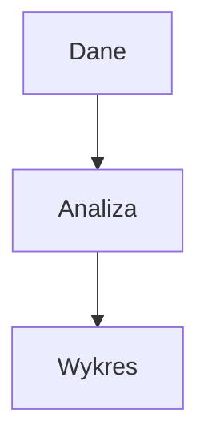

# L01 Laboratorium — Plan zajęć

## Temat: Konfiguracja warsztatu pracy analityka danych

### Informacje organizacyjne
- **Czas:** 90 min (2h akademickie)
- **Forma:** ćwiczenia praktyczne przy komputerach
- **Prowadzący:** doktorant (materiały przygotowane przez prowadzącego wykład)
- **Sala:** komputerowa z dostępem do internetu
- **Potrzebne:** komputer z prawami administratora (lub laptopy studentów)

### Efekty uczenia się (Bloom)
Po tym laboratorium osoba studiująca:
1. **Instaluje** Python, uv, VS Code i Git na swoim komputerze (Bloom 3)
2. **Tworzy** repozytorium Git, wykonuje commit i push na GitHub (Bloom 3)
3. **Pisze** prosty dokument w Markdown z formatowaniem i listami (Bloom 3)
4. **Konfiguruje** środowisko wirtualne i instaluje pakiety przez uv (Bloom 3)

## Przydatne linki dla prowadzącego

- [uv — oficjalna dokumentacja](https://docs.astral.sh/uv/)
- [Git — oficjalny podręcznik](https://git-scm.com/book/pl/v2)
- [VS Code — Python Tutorial](https://code.visualstudio.com/docs/python/python-tutorial)
- [GitHub — tworzenie konta i repo](https://docs.github.com/en/get-started/quickstart)

### Przed zajęciami — przygotowanie prowadzącego
1. Sprawdź, czy na komputerach w sali jest:
   - Python 3.10+ (`python3 --version`)
   - Git (`git --version`)
   - VS Code (`code --version`)
   - Dostęp do internetu (potrzebny do instalacji uv, push na GitHub)
2. Jeśli brakuje — zainstaluj przed zajęciami lub poproś studentów o laptopy
3. Przeczytaj **01_srodowisko_pracy.md** z katalogu wykładowego — tam jest pełna instrukcja instalacji
4. Przetestuj wszystkie ćwiczenia sam — upewnij się, że działają na komputerach w sali

### Plan minutowy

| Czas | Etap | Co robisz | Uwagi |
|------|------|-----------|-------|
| 0:00-0:05 | **WPROWADZENIE** | Przedstaw się, wyjaśnij plan zajęć, powiąż z wykładem | Krótko — studenci chcą działać |
| 0:05-0:25 | **ĆW. 1** | Instalacja narzędzi (Python, uv, VS Code, Git) | Pomagaj indywidualnie |
| 0:25-0:45 | **ĆW. 2** | Git: pierwsze repo, commit, push na GitHub | Krok po kroku |
| 0:45-0:55 | **PRZERWA** | 10 minut | — |
| 0:55-1:15 | **ĆW. 3** | Markdown: napisz README.md, podgląd w VS Code | Kreatywne |
| 1:15-1:30 | **ĆW. 4** | VS Code + venv + pierwszy skrypt .py | Weryfikacja środowiska |
| 1:25-1:30 | **ĆW. 5** | Jupyter Notebook w VS Code — test | Szybki test |
| 1:30-1:38 | **ĆW. 6** | Struktura repo na semestr + udostępnienie prowadzącemu | Krok po kroku |
| 1:38-1:45 | **PODSUMOWANIE** | Sprawdź kto skończył, zbierz linki do repo | Zbierz feedback |

---

## INSTRUKCJA DLA PROWADZĄCEGO — krok po kroku

### 0:00-0:05 — WPROWADZENIE

**Co mówisz:**
> "Dzień dobry, jestem [imię] i prowadzę z wami laboratoria z Programowania w Pythonie II. Na wykładzie dr Zygarlicki opowiadał o narzędziach, które będziemy używać — dzisiaj je zainstalujemy i przetestujemy. Na koniec zajęć każdy z was będzie miał działające środowisko i własne repozytorium na GitHubie."

**Ważne:**
- Zapytaj kto ma laptopa, kto pracuje na komputerze uczelnianym
- Zapytaj kto już ma konto na GitHubie (z wykładu mogli założyć)
- Nie tłumacz teorii — to było na wykładzie. Tutaj **robimy**.

---

### 0:05-0:25 — ĆWICZENIE 1: Instalacja narzędzi (20 min)

**Cel:** Każdy student ma działający Python, uv, VS Code i Git.

**Co robisz:**
1. Wyświetl na projektorze plik **cwiczenia.md — Ćwiczenie 1**
2. Pokaż pierwszy krok na projektorze, poczekaj aż wszyscy zrobią
3. Przechodź między rzędami i pomagaj

**Typowe problemy:**
- **Windows:** Python nie w PATH → zaznacz "Add Python to PATH" przy instalacji, lub dodaj ręcznie
- **Windows:** PowerShell blokuje skrypty → `Set-ExecutionPolicy -Scope CurrentUser RemoteSigned`
- **Linux (sala):** brak sudo → Python i Git zwykle są, uv można zainstalować w `~/.local/`
- **macOS:** brak Homebrew → pokaż instalację: `/bin/bash -c "$(curl -fsSL ...)"`

**Sprawdzenie (każdy musi to uruchomić):**
```bash
python3 --version    # lub python --version na Windows
uv --version
git --version
code --version
```

> "Jeśli wszystkie 4 komendy zwracają wersje — macie skonfigurowane narzędzia. Jeśli coś nie działa — dajcie znać."

**Fallback:** Jeśli ktoś nie może zainstalować (np. brak uprawnień) — niech pracuje w parze z kimś, kto ma działające środowisko. Na następne zajęcia musi przynieść laptopa lub rozwiązać problem.

---

### 0:25-0:45 — ĆWICZENIE 2: Git — pierwsze repo (20 min)

**Cel:** Każdy student ma konto GitHub, lokalne repo, wykonał commit i push.

**Co robisz:**
1. Pokaż na projektorze ćwiczenie 2 krok po kroku
2. **Ważne:** Konfiguracja Git (imię, email) — bez tego commit nie zadziała
3. Pokaż każdy krok, poczekaj aż wszyscy zrobią

**Kroki (na projektorze):**
```bash
# 1. Konfiguracja Git (jednorazowo)
git config --global user.name "Imię Nazwisko"
git config --global user.email "email@example.com"

# 2. Tworzenie repozytorium
mkdir python2-lab
cd python2-lab
git init

# 3. Pierwszy plik
echo "# Moje laboratorium Python II" > README.md

# 4. Pierwszy commit
git add README.md
git commit -m "Pierwszy commit — dodaj README"
```

**GitHub:**
1. Jeśli ktoś nie ma konta — niech założy teraz (github.com → Sign up)
2. Pokaż jak utworzyć nowe repo na GitHubie (New repository → "python2-lab" → Create)
3. Pokaż jak połączyć lokalne repo z GitHub:
```bash
git remote add origin https://github.com/UŻYTKOWNIK/python2-lab.git
git push -u origin master
```

**Uwaga o autentykacji:**
- GitHub wymaga tokenu (nie hasła) do push przez HTTPS
- Pokaż: Settings → Developer settings → Personal access tokens → Generate new token (classic)
- Albo użyj `gh auth login` (jeśli zainstalowano GitHub CLI)
- **Alternatywa:** klucze SSH — ale to bardziej skomplikowane, można zostawić na później

**Sprawdzenie:** Otwórz github.com/UŻYTKOWNIK/python2-lab w przeglądarce — widać README.md.

---

### 0:45-0:55 — PRZERWA (10 min)

> "10 minut przerwy. Kto nie skończył — dokańczajcie. Pomagam tym, którzy mają problemy."

---

### 0:55-1:15 — ĆWICZENIE 3: Markdown (20 min)

**Cel:** Każdy pisze sensowne README.md w Markdown i pushuje na GitHub.

**Co robisz:**
1. Otwórz VS Code z podglądem Markdown (`Ctrl+Shift+V`)
2. Pokaż składnię: nagłówki, listy, pogrubienie, kod, tabela
3. Daj studentom szablon (ćwiczenie 3 w cwiczenia.md) i czas na pisanie

**Ważne:**
- To ćwiczenie jest **kreatywne** — studenci piszą o sobie
- Nie oceniaj treści, oceniaj **poprawność Markdown**
- Po napisaniu: `git add README.md && git commit -m "Rozbuduj README" && git push`
- Pokaż jak wygląda na GitHubie

**Bonus dla szybkich:** Dodaj diagram Mermaid:
```markdown

```

---

### 1:15-1:30 — ĆWICZENIE 4: venv + pierwszy skrypt (15 min)

**Cel:** Student tworzy venv, instaluje pakiety, uruchamia skrypt .py.

**Co robisz:**
1. Pokaż tworzenie venv i instalację pakietów
2. Pokaż jak napisać i uruchomić skrypt w VS Code

**Kroki:**
```bash
# W katalogu projektu
uv venv
source .venv/bin/activate       # Linux/macOS
# .venv\Scripts\Activate.ps1    # Windows PowerShell

# Instalacja pakietów
uv pip install numpy pandas matplotlib

# Sprawdzenie
python -c "import numpy; import pandas; import matplotlib; print('Wszystko działa!')"
```

**Skrypt `hello_data.py`:**
```python
import numpy as np

dane = np.array([10, 20, 30, 40, 50])
print(f"Dane: {dane}")
print(f"Średnia: {dane.mean():.1f}")
print(f"Suma: {dane.sum()}")
print(f"Min: {dane.min()}, Max: {dane.max()}")
```

**Ważne:**
- Dodaj `.venv/` do `.gitignore`!
- Pokaż: `echo ".venv/" > .gitignore && git add .gitignore hello_data.py && git commit -m "Dodaj skrypt i gitignore"`

---

### 1:30-1:40 — ĆWICZENIE 5: Jupyter Notebook (10 min)

**Cel:** Student otwiera notebook w VS Code i uruchamia komórkę.

**Co robisz:**
1. `Ctrl+Shift+P` → "Create New Jupyter Notebook"
2. Wybierz kernel: Python z `.venv`
3. Wpisz w pierwszą komórkę:

```python
2 + 2
```

4. Uruchom (`Shift+Enter`) — pokaż wynik
5. Druga komórka:

```python
import numpy as np
dane = np.array([10, 20, 30, 40, 50])
print(f"Średnia: {dane.mean()}")
```

**Uwaga:** Jeśli VS Code nie widzi kernela — trzeba zainstalować `ipykernel`:
```bash
uv pip install ipykernel
```

**Sprawdzenie:** Notebook uruchamia się, wynik widoczny pod komórką.

> "Na przyszłych zajęciach będziemy intensywnie korzystać z notebooków. Na razie ważne, że działa."

---

### 1:30-1:38 — ĆWICZENIE 6: Struktura repo + udostępnienie (8 min)

**Cel:** Każdy student ma strukturę folderów na cały semestr i prowadzący ma wgląd w repo.

**Co robisz:**
1. Pokaż jak utworzyć foldery `lab01` - `lab14` + `projekt`
2. Pokaż jak dodać prowadzącego jako collaboratora (Settings → Collaborators → Add → **sp6jaz**)
3. **Zbierz linki do repozytoriów** — niech studenci wpiszą je na tablicy/czacie Moodle/kartce:
   ```
   Imię Nazwisko — https://github.com/LOGIN/python2-lab
   ```

**Ważne:**
- Jeśli repo jest publiczne — wystarczy link, nie trzeba dodawać collaboratora
- Jeśli prywatne — MUSZĄ dodać `sp6jaz`
- **Zbierz linki!** Bez linku nie masz wglądu i nie możesz oceniać

---

### 1:38-1:45 — PODSUMOWANIE (7 min)

**Co mówisz:**
> "Podsumujmy. Dzisiaj zainstalowaliście narzędzia, stworzyliście repozytorium na GitHubie, napisaliście dokumentację w Markdown, uruchomiliście skrypt i Jupytera, przygotowaliście strukturę na cały semestr i udostępniliście mi repo. To fundament — na kolejnych zajęciach zaczynamy analizę danych z NumPy."

> "Plik **jak_pracowac.md** znajdziecie na Moodle — przeczytajcie go w domu. Opisuje jak ma wyglądać wasza praca na KAŻDYM laboratorium: aktywacja venv, notebook w folderze labXX, commit po ćwiczeniu, push na GitHub."

**Sprawdź:**
- Kto ma wszystko działające? (ręce w górę)
- Kto wysłał link do repo?
- Kto ma problemy? (pomagam po zajęciach lub umów się na konsultacje)

**Zadanie domowe:**
> "Na następne zajęcia: upewnijcie się, że środowisko działa. Przetestujcie w domu. Przeczytajcie jak_pracowac.md. Jeśli macie problemy — napiszcie na Moodle."

---

## Notatki dla prowadzącego

### Najczęstsze problemy i rozwiązania

| Problem | Rozwiązanie |
|---------|-------------|
| Python nie w PATH (Windows) | Reinstalacja z zaznaczonym "Add to PATH" |
| `uv` nie działa po instalacji | Zamknij i otwórz terminal ponownie |
| Git push odmawia (401) | Token GitHub: Settings → Developer settings → Personal access tokens |
| VS Code nie widzi Pythona z venv | Ctrl+Shift+P → "Python: Select Interpreter" → wybierz `.venv` |
| Jupyter kernel nie działa | `uv pip install ipykernel`, restart VS Code |
| Brak sudo na komputerze uczelnianym | Instalacja uv do `~/.local/`, Python systemowy |

### Pair programming
- Jeśli ktoś jest kompletnie zablokowany — połącz go z sąsiadem
- Lepiej pracować w parze niż siedzieć z błędem
- Na przyszłych laborkach pair programming będzie regularny

### Tempo
- Ćwiczenie 1 (instalacja) pochłania najwięcej czasu — zwłaszcza na Windows
- Jeśli instalacja ciągnie się >25 min — przejdź dalej z tymi co mają, reszta nadrabia w przerwie
- Ćwiczenie 5 (Jupyter) jest opcjonalne — jeśli brakuje czasu, pomiń
