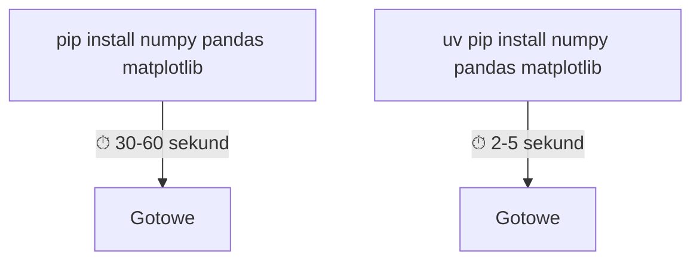
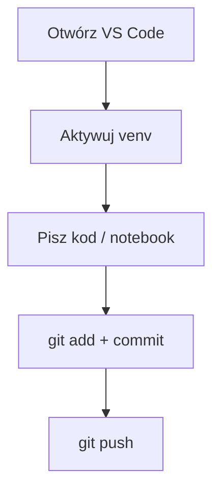

# Środowisko pracy — instalacja i konfiguracja

## Narzędzia kursu

| Narzędzie | Do czego | Wersja |
|-----------|----------|--------|
| Python 3.10+ | język programowania | 3.10 / 3.12 / 3.13 |
| uv | menedżer pakietów i środowisk wirtualnych | 0.10+ |
| VS Code | edytor kodu + Jupyter + Git | najnowsza |
| Git | kontrola wersji | 2.30+ |
| GitHub | hosting repozytoriów, portfolio | konto darmowe |

---

## 1. Instalacja Pythona

### Windows

1. Wejdź na https://www.python.org/downloads/
2. Pobierz najnowszą wersję (3.12 lub 3.13)
3. Uruchom instalator
4. **WAŻNE:** zaznacz checkbox **"Add Python to PATH"**
5. Kliknij "Install Now"

Weryfikacja w PowerShell:
```powershell
python --version
```

### Linux (Ubuntu/Debian)

```bash
sudo apt update
sudo apt install python3 python3-venv python3-pip
python3 --version
```

### macOS

```bash
brew install python
python3 --version
```

---

## 2. Instalacja uv

`uv` to ultraszybki menedżer pakietów Pythona od firmy Astral. Zastępuje `pip`, `venv` i `pyenv` jednym narzędziem.

### Windows (PowerShell)

```powershell
powershell -ExecutionPolicy ByPass -c "irm https://astral.sh/uv/install.ps1 | iex"
```

Po instalacji zamknij i otwórz ponownie PowerShell.

### Linux / macOS

```bash
curl -LsSf https://astral.sh/uv/install.sh | sh
```

### Weryfikacja

```bash
uv --version
```

### Dlaczego uv zamiast pip?



`uv` jest 10-100× szybszy od `pip`. Napisany w Rust, rozwiązuje zależności błyskawicznie.

---

## 3. Instalacja VS Code

### Windows

1. Pobierz z https://code.visualstudio.com/
2. Uruchom instalator
3. **Zaznacz:** "Add to PATH", "Register as default editor"

### Linux (Ubuntu)

```bash
sudo snap install code --classic
```

### Wymagane rozszerzenia (extensions)

Po uruchomieniu VS Code, zainstaluj rozszerzenia (Ctrl+Shift+X):

| Extension | ID | Do czego |
|-----------|-----|----------|
| Python | ms-python.python | obsługa Pythona |
| Jupyter | ms-toolsai.jupyter | notebooki .ipynb |
| GitLens | eamodio.gitlens | zaawansowany Git |

Można zainstalować z terminala:
```bash
code --install-extension ms-python.python
code --install-extension ms-toolsai.jupyter
code --install-extension eamodio.gitlens
```

---

## 4. Instalacja Git

### Windows

1. Pobierz z https://git-scm.com/download/win
2. Uruchom instalator, **domyślne opcje** są OK
3. Wybierz "Use Git from the Windows Command Prompt"

### Linux (Ubuntu)

```bash
sudo apt install git
```

### Konfiguracja (obowiązkowa, jednorazowa)

```bash
git config --global user.name "Imię Nazwisko"
git config --global user.email "twoj@email.com"
```

---

## 5. Konto na GitHub

1. Wejdź na https://github.com/
2. Załóż darmowe konto (użyj maila uczelnianego — daje dostęp do GitHub Student Pack)
3. Opcjonalnie: skonfiguruj klucz SSH (wygodniejsze niż hasło)

---

## 6. Tworzenie projektu — pełny workflow

### Krok po kroku

```bash
# 1. Utwórz katalog projektu
mkdir moj-projekt
cd moj-projekt

# 2. Inicjalizuj repozytorium Git
git init

# 3. Utwórz środowisko wirtualne
uv venv

# 4. Aktywuj środowisko
# Linux/macOS:
source .venv/bin/activate
# Windows (PowerShell):
# .venv\Scripts\Activate.ps1

# 5. Zainstaluj biblioteki
uv pip install numpy pandas matplotlib jupyter

# 6. Otwórz VS Code w tym katalogu
code .
```

### Struktura projektu po konfiguracji

```
moj-projekt/
├── .venv/              ← środowisko wirtualne (NIE dodajemy do Git!)
├── .gitignore          ← lista plików ignorowanych przez Git
├── requirements.txt    ← lista bibliotek projektu
├── README.md           ← opis projektu
└── analiza.ipynb       ← notebook z analizą
```

### Plik .gitignore (obowiązkowy!)

```
.venv/
__pycache__/
*.pyc
.ipynb_checkpoints/
.DS_Store
```

### Plik requirements.txt

```
numpy
pandas
matplotlib
seaborn
scipy
jupyter
```

---

## 7. Pierwszy commit

```bash
git add .
git commit -m "Inicjalizacja projektu"
```

### Publikacja na GitHub

```bash
# Utwórz repozytorium na GitHub (przez stronę lub gh CLI)
git remote add origin https://github.com/TWOJ-LOGIN/moj-projekt.git
git push -u origin master
```

---

## 8. Codzienny workflow



### Windows (PowerShell)
```powershell
cd moj-projekt
.venv\Scripts\Activate.ps1
code .
```

### Linux/macOS
```bash
cd moj-projekt
source .venv/bin/activate
code .
```

---

## 9. Szybka ściągawka poleceń

| Co chcę zrobić | Polecenie |
|---------------|-----------|
| Utworzyć venv | `uv venv` |
| Aktywować venv (Linux) | `source .venv/bin/activate` |
| Aktywować venv (Windows) | `.venv\Scripts\Activate.ps1` |
| Zainstalować pakiet | `uv pip install nazwa` |
| Zainstalować z requirements.txt | `uv pip install -r requirements.txt` |
| Sprawdzić zainstalowane pakiety | `uv pip list` |
| Nowy commit | `git add . && git commit -m "opis"` |
| Wypchnąć na GitHub | `git push` |
| Uruchomić Jupyter w przeglądarce | `jupyter notebook` |

---

## Najczęstsze problemy

### Windows: "python nie jest rozpoznawany"
→ Reinstaluj Pythona z zaznaczonym **"Add Python to PATH"**

### Windows: "uv nie jest rozpoznawany"
→ Zamknij i otwórz ponownie PowerShell po instalacji uv

### Windows: ".venv\Scripts\Activate.ps1 nie można uruchomić"
→ Uruchom PowerShell jako Administrator i wpisz:
```powershell
Set-ExecutionPolicy -ExecutionPolicy RemoteSigned -Scope CurrentUser
```

### "No module named numpy" (mimo instalacji)
→ Sprawdź czy aktywowałeś venv (w terminalu powinno być `(.venv)` przed promptem)
