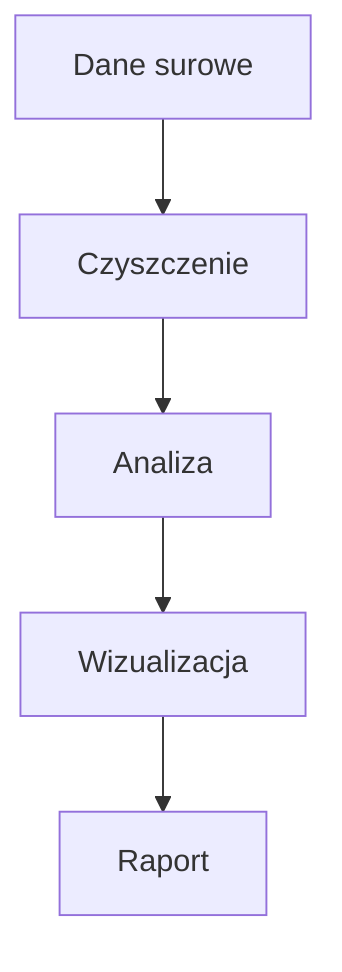

# W01 Wykład — Plan zajęć dla prowadzącego

## Temat: Warsztat pracy analityka danych

### Informacje organizacyjne
- **Czas:** 90 min (2h akademickie)
- **Forma:** wykład konwersatoryjny z live coding
- **Potrzebne:** komputer z projektorem, VS Code, terminal, internet
- **Materiały do rozdania:** brak (wszystko na Moodle + GitHub)

### Efekty uczenia się (Bloom)
Po tym wykładzie osoba studiująca:
1. **Wyjaśnia** rolę Git, GitHub, Markdown i venv w pracy analityka danych (Bloom 1-2)
2. **Rozpoznaje** elementy składni Markdown i Mermaid (Bloom 1)
3. **Opisuje** workflow analityka: kod → commit → push → dokumentacja (Bloom 1-2)

### Plan minutowy

| Czas | Etap | Co robisz | Jak |
|------|------|-----------|-----|
| 0:00-0:10 | **WPROWADZENIE** | WOW-efekt + przedstawienie się + ankieta | Demo live |
| 0:10-0:20 | **MATERIAŁ 1** | Organizacja kursu: KOP, zasady, ocenianie | Slajd/rozmowa |
| 0:20-0:35 | **MATERIAŁ 2** | Git i GitHub — po co, jak, workflow | Live coding |
| 0:35-0:50 | **MATERIAŁ 3** | Markdown + Mermaid — dokumentacja jak profesjonalista | Live coding |
| 0:50-1:00 | **PRZERWA** | 10 minut | — |
| 1:00-1:15 | **MATERIAŁ 4** | VS Code + uv + venv — narzędzia kursu | Live coding |
| 1:15-1:25 | **MATERIAŁ 5** | Jupyter Notebook — krótki pokaz | Live demo |
| 1:25-1:35 | **AKTYWNOŚĆ** | Mini-ćwiczenie: napisz README.md w Markdown | Studenci piszą |
| 1:35-1:45 | **PODSUMOWANIE** | 3 bullet points, co na lab, zadanie domowe | Rozmowa |

---

## STENOGRAM — co mówić i robić

### 0:00-0:10 — WPROWADZENIE (WOW-efekt)

**[Otwórz VS Code z przygotowanym notebookiem `wow_demo.ipynb`]**

> "Dzień dobry, jestem dr hab. Jarosław Zygarlicki i prowadzę z wami Programowanie w Pythonie II. Zanim cokolwiek powiem o kursie — pokażę wam coś."

**[Uruchom notebook — 10 linii kodu, od CSV do wykresu]**

```python
import pandas as pd
import matplotlib.pyplot as plt

df = pd.read_csv('https://raw.githubusercontent.com/mwaskom/seaborn-data/master/tips.csv')
print(f"Dataset: {len(df)} wierszy, {len(df.columns)} kolumn")
print(df.head())
print(f"\nŚredni rachunek: {df['total_bill'].mean():.2f} $")
df.groupby('day')['total_bill'].mean().plot(kind='bar', title='Średni rachunek wg dnia tygodnia')
plt.ylabel('USD')
plt.tight_layout()
plt.savefig('wykres.png')
plt.show()
```

> "10 linii kodu. Wczytaliśmy dane z internetu, przeanalizowaliśmy je i zrobiliśmy wykres. Na końcu tego semestru będziecie robić takie rzeczy w śnie. Ale nie o kod tu chodzi — chodzi o **umiejętność opowiedzenia historii danymi**. Bo wy skończycie kierunek Analityka Danych w Biznesie — a to oznacza, że waszym zadaniem będzie zamieniać surowe dane w **decyzje biznesowe**."

> "Dzisiaj nie będziemy jeszcze kodować — dzisiaj zbudujemy **warsztat pracy**. Takie narzędzia, których używa każdy profesjonalny analityk."

**[Pokaż krótką ankietę — 3 pytania, Mentimeter lub kartka]**

> "Ale najpierw — chcę wiedzieć, kim jesteście. Krótka ankieta, 2 minuty."

Ankieta:
1. Jak oceniasz swoją znajomość Pythona? (1-5)
2. Co cię najbardziej interesuje? (sport / muzyka / finanse / gry / zdrowie / inne)
3. Czego oczekujesz od tego kursu?

---

### 0:10-0:20 — MATERIAŁ 1: Organizacja kursu

> "Zanim ruszymy — kilka spraw organizacyjnych."

**[Pokaż KOP / slajd z informacjami]**

Omów:
- **Przedmiot:** Programowanie w języku Python II (K.05), 5 ECTS
- **Forma:** wykład (30h) + laboratorium (30h)
- **Zaliczenie:** egzamin pisemny + cząstkowe zadania laboratoryjne
- **Kontakt:** email, Moodle, GitHub
- **Materiały:** Moodle + repozytorium GitHub kursu

> "Ocenianie. Laboratorium to cząstkowe zadania — robicie je na zajęciach, oddajecie przez GitHub. Egzamin pisemny na koniec. Ale ważna rzecz — **ten kurs jest praktyczny**. Nie chodzi o to, żebyście zapamiętali składnię. Chodzi o to, żebyście **potrafili rozwiązywać problemy z danymi**."

**Narzędzia kursu:**

> "Będziemy pracować na profesjonalnych narzędziach. Nie Anaconda, nie Colab — prawdziwy stack, taki jak w firmach analitycznych."

| Narzędzie | Do czego |
|-----------|----------|
| Python 3.10+ | język |
| uv | pakiety i środowiska |
| VS Code | edytor + Jupyter + Git |
| Git + GitHub | wersjonowanie, portfolio |

> "Dlaczego nie Anaconda? Bo jest ciężka, komercyjna i uczy was ekosystemu, który nie istnieje poza uczelnią. My będziemy używać narzędzi, z których korzystają profesjonaliści."

---

### 0:20-0:35 — MATERIAŁ 2: Git i GitHub (live coding)

> "Git to system kontroli wersji. Ale co to znaczy w praktyce?"

**[Otwórz terminal]**

> "Wyobraźcie sobie, że piszecie raport w Wordzie. Macie pliki: raport_v1.docx, raport_v2.docx, raport_final.docx, raport_final_final.docx, raport_naprawde_final.docx..."

**[Pauza na śmiech]**

> "Git rozwiązuje ten problem. Macie JEDEN plik, a Git pamięta KAŻDĄ wersję. Możecie wrócić do dowolnego momentu w historii."

**[Live demo — pisz powoli, komentuj każdy krok]**

```bash
mkdir moj-pierwszy-projekt
cd moj-pierwszy-projekt
git init
```

> "Właśnie stworzyliśmy repozytorium. Git śledzi teraz wszystko co się tu dzieje."

```bash
echo "# Mój pierwszy projekt" > README.md
git add README.md
git commit -m "Dodaj README"
```

> "Trzy kroki: **add** — mówisz gitowi co chcesz zapisać. **commit** — zapisujesz migawkę. **-m** — krótki opis co zrobiłeś i dlaczego."

> "A GitHub? GitHub to jak Dysk Google dla kodu. Wasz kod jest w chmurze, możecie go udostępnić, współpracować z innymi. I co najważniejsze — **to wasze portfolio**. Pracodawca wchodzi na wasz GitHub i widzi co potraficie."

**[Pokaż swój/przykładowy profil GitHub]**

> "Na laboratorium za chwilę założycie konta i wypchnięcie swój pierwszy projekt."

---

### 0:35-0:50 — MATERIAŁ 3: Markdown + Mermaid (live coding)

> "Skoro mamy Git i GitHub — potrzebujemy sposobu na pisanie dokumentacji. W Wordzie? Nie. W PDF? Nie. W **Markdown**."

**[Otwórz VS Code, nowy plik `demo.md`]**

> "Markdown to język znaczników. Prosty jak notatnik, ale renderuje się pięknie na GitHubie."

**[Pisz na żywo, pokaż podgląd Ctrl+Shift+V]**

```markdown
# Nagłówek pierwszego poziomu
## Nagłówek drugiego poziomu

To jest **pogrubienie** a to *kursywa*.

Lista:
- punkt 1
- punkt 2
- punkt 3

Kod Pythona:
```python
print("Hello, Data Science!")
```

| Kolumna A | Kolumna B |
|-----------|-----------|
| wartość 1 | wartość 2 |
```

> "Zobaczcie — to jest zwykły tekst. Ale na GitHubie wygląda jak profesjonalny dokument."

**[Pokaż jak wygląda na GitHub]**

> "A teraz coś jeszcze lepszego — **Mermaid**. Diagramy pisane tekstem."

```markdown

```

**[Pokaż jak renderuje się na GitHub]**

> "Napisaliście diagram w 5 linijkach tekstu. Nie PowerPoint, nie draw.io — **tekst**, który Git śledzi, który można edytować i który zawsze wygląda dobrze."

---

### 0:50-1:00 — PRZERWA (10 min)

> "10 minut przerwy. Jak chcecie — otwórzcie github.com i załóżcie konto, przyda się na labie."

---

### 1:00-1:15 — MATERIAŁ 4: VS Code + uv + venv

> "Wracamy. Teraz pokażę wam narzędzia, na których będziemy pracować cały semestr."

**[Otwórz VS Code]**

> "VS Code — darmowy edytor od Microsoftu. Ma wbudowany terminal, Git, Jupyter Notebook. Wszystko w jednym oknie."

**[Pokaż: terminal, Git panel, extensions]**

> "Potrzebujecie 3 rozszerzenia: Python, Jupyter, GitLens. Na labie zainstalujecie."

**[Przejdź do terminala]**

> "Teraz — środowisko wirtualne. Po co? Bo różne projekty potrzebują różnych wersji bibliotek. Projekt A potrzebuje pandas 1.5, projekt B potrzebuje pandas 2.0. Bez venv — chaos. Z venv — porządek."

```bash
uv venv
source .venv/bin/activate   # Linux
# .venv\Scripts\Activate.ps1  # Windows
uv pip install numpy pandas matplotlib
```

> "Zauważcie jak szybko to działa. `uv` jest 10-100 razy szybszy niż `pip`. Napisany w Rust."

> "I ważna zasada: **venv NIE idzie do Gita**. Do Gita idzie plik `requirements.txt` — lista bibliotek. Kolega klonuje wasze repo, robi `uv pip install -r requirements.txt` i ma identyczne środowisko."

---

### 1:15-1:25 — MATERIAŁ 5: Jupyter Notebook — szybki pokaz

> "Ostatnie narzędzie — Jupyter Notebook. Znacie Colaba z poprzedniego semestru — Jupyter to jest to samo, ale lokalne, wasze, pod waszą kontrolą."

**[Otwórz notebook w VS Code — Ctrl+Shift+P → "Create New Jupyter Notebook"]**

```python
# Komórka 1
2 + 2
```

```python
# Komórka 2
import numpy as np
dane = np.array([10, 20, 30, 40, 50])
print(f"Średnia: {dane.mean()}")
```

> "Komórki. Uruchamiacie jedną po drugiej. Wynik widać od razu. Idealny do eksploracji danych — próbujesz, widzisz, poprawiasz."

> "Na tym kursie będziecie pracować w dwóch trybach: notebooki `.ipynb` do eksploracji i wykresów, skrypty `.py` do czystego kodu i funkcji."

---

### 1:25-1:35 — AKTYWNOŚĆ: mini-ćwiczenie

> "Czas na was. Weźcie kartkę — albo otwórzcie notatnik na telefonie — i napiszcie w Markdown krótki opis siebie. 5 minut."

**Szablon:**
```markdown
# [Twoje imię]

## O mnie
Studiuję [kierunek] na Politechnice Opolskiej.

## Zainteresowania
- [coś]
- [coś]
- [coś]

## Czego chcę się nauczyć na tym kursie
1. [coś]
2. [coś]
```

> "Na laboratorium wrzucicie to jako README.md do swojego pierwszego repozytorium."

**[Po 5 minutach]**

> "Kto chce pokazać? ...Świetnie. Zauważcie — to jest wasz przyszły profil na GitHubie. Pracodawca to zobaczy."

---

### 1:35-1:45 — PODSUMOWANIE

> "Podsumujmy. Dzisiaj poznaliście 4 narzędzia profesjonalnego analityka:"

> "1. **Git + GitHub** — wersjonowanie kodu i portfolio"
> "2. **Markdown + Mermaid** — dokumentacja i diagramy"
> "3. **VS Code** — jeden edytor do wszystkiego"
> "4. **uv + venv** — zarządzanie pakietami i środowiskami"

> "Na laboratorium **zainstalujecie** te narzędzia i **stworzycie** swoje pierwsze repozytorium. Jeśli macie laptopy — przynieście. Jeśli nie — będziecie pracować na komputerach w sali."

**Zadanie domowe (nieoceniane):**
> "Przed następnymi zajęciami: (1) załóżcie konto na GitHub, (2) zainstalujcie VS Code i Python. Instrukcja jest na Moodle."

> "Za tydzień zaczniemy analizę danych. Zobaczycie jak wczytać prawdziwy dataset, wyczyścić go i zrobić pierwszy wykres. Do zobaczenia!"
