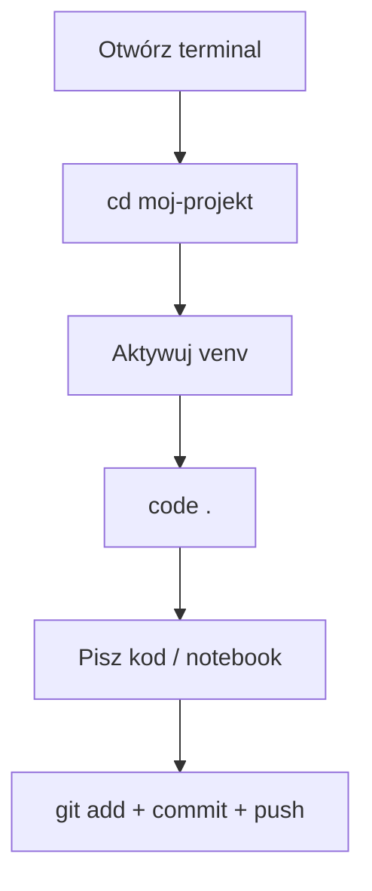
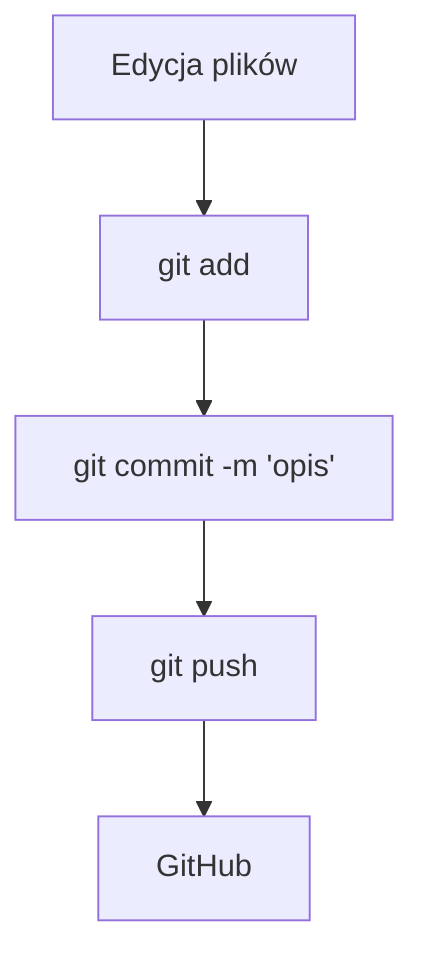
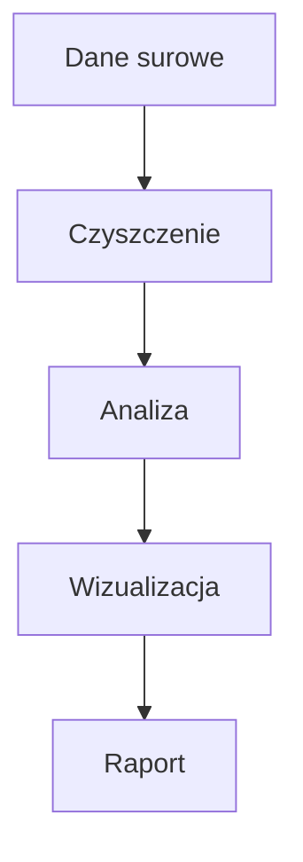
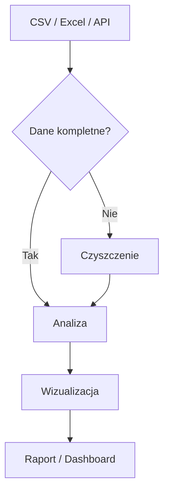

# Programowanie w języku Python II — Skrypt dla studentów

**Kierunek:** Analityka danych w biznesie
**Politechnika Opolska, Wydział Elektrotechniki, Automatyki i Informatyki**
**Autor:** dr hab. inż. Jarosław Zygarlicki

---

## Spis treści

1. [Warsztat pracy analityka](#1-warsztat-pracy-analityka)
2. [Wprowadzenie do analizy danych](#2-wprowadzenie-do-analizy-danych)
3. [NumPy — obliczenia numeryczne](#3-numpy--obliczenia-numeryczne)
4. [Pandas — przetwarzanie i analiza danych](#4-pandas--przetwarzanie-i-analiza-danych)
5. [Matplotlib — wizualizacja danych](#5-matplotlib--wizualizacja-danych)
6. [Statystyka w Pythonie](#6-statystyka-w-pythonie)
7. [Zaawansowane biblioteki i narzędzia](#7-zaawansowane-biblioteki-i-narzędzia)
8. [LLM i AI w analizie danych](#8-llm-i-ai-w-analizie-danych)

---

## 1. Warsztat pracy analityka

### 1.1 Środowisko pracy

W tym kursie korzystamy z profesjonalnych narzędzi stosowanych w branży analityki danych:

| Narzędzie | Do czego | Dlaczego |
|-----------|----------|----------|
| **Python 3.10+** | język programowania | standard w data science |
| **uv** | menedżer pakietów i venv | 10-100× szybszy od pip |
| **VS Code** | edytor + Jupyter + Git | standard branży, darmowy |
| **Git + GitHub** | kontrola wersji, portfolio | każda firma tego wymaga |

#### Instalacja Pythona

**Windows:**
1. Pobierz instalator z https://www.python.org/downloads/
2. **Zaznacz "Add Python to PATH"** — to krytyczne!
3. Kliknij "Install Now"

**Linux (Ubuntu/Debian):**
```bash
sudo apt update && sudo apt install python3 python3-venv python3-pip
```

Weryfikacja: `python --version` (Windows) lub `python3 --version` (Linux)

#### Instalacja uv

`uv` to ultraszybki menedżer pakietów od firmy Astral. Zastępuje `pip` + `venv` + `pyenv` jednym narzędziem.

**Windows (PowerShell):**
```powershell
powershell -ExecutionPolicy ByPass -c "irm https://astral.sh/uv/install.ps1 | iex"
```

**Linux / macOS:**
```bash
curl -LsSf https://astral.sh/uv/install.sh | sh
```

#### Instalacja VS Code

1. Pobierz z https://code.visualstudio.com/
2. Zainstaluj rozszerzenia (Ctrl+Shift+X):
   - **Python** (ms-python.python)
   - **Jupyter** (ms-toolsai.jupyter)
   - **GitLens** (eamodio.gitlens)

#### Instalacja Git

**Windows:** pobierz z https://git-scm.com/download/win (domyślne opcje OK)
**Linux:** `sudo apt install git`

Konfiguracja (jednorazowa):
```bash
git config --global user.name "Imię Nazwisko"
git config --global user.email "twoj@email.com"
```

#### Tworzenie projektu — pełny workflow

```bash
mkdir moj-projekt && cd moj-projekt   # utwórz katalog
git init                               # inicjalizuj Git
uv venv                                # utwórz środowisko wirtualne
source .venv/bin/activate              # aktywuj (Linux)
# .venv\Scripts\Activate.ps1           # aktywuj (Windows)
uv pip install numpy pandas matplotlib jupyter  # zainstaluj biblioteki
code .                                 # otwórz VS Code
```

#### Codzienny workflow



#### Najczęstsze problemy

| Problem | Rozwiązanie |
|---------|-------------|
| `python nie jest rozpoznawany` (Windows) | Reinstaluj z "Add to PATH" |
| `uv nie jest rozpoznawany` | Zamknij i otwórz ponownie terminal |
| Activate.ps1 nie działa | `Set-ExecutionPolicy RemoteSigned -Scope CurrentUser` |
| `No module named numpy` | Sprawdź czy aktywowałeś venv — `(.venv)` w prompcie |

### 1.2 Git i GitHub

#### Czym jest Git?

Git to **system kontroli wersji** — narzędzie, które śledzi każdą zmianę w twoich plikach. Zamiast tworzyć kopie (`raport_v1.docx`, `raport_final.docx`, `raport_naprawde_final.docx`), masz **jeden plik** i pełną historię zmian.

#### Podstawowe pojęcia

| Pojęcie | Znaczenie |
|---------|-----------|
| **Repozytorium (repo)** | Katalog śledzony przez Git |
| **Commit** | Migawka — zapisany stan projektu w danym momencie |
| **Staging area** | Poczekalnia — pliki przygotowane do commita |
| **Branch** | Gałąź — równoległa linia rozwoju kodu |
| **Remote** | Zdalne repozytorium (np. na GitHubie) |
| **Push** | Wypchnięcie commitów na zdalny serwer |
| **Pull** | Pobranie zmian ze zdalnego serwera |
| **Clone** | Skopiowanie zdalnego repozytorium na komputer |

#### Workflow Git — 3 komendy

```bash
git add plik.py          # 1. Dodaj plik do poczekalni
git commit -m "Opis"     # 2. Zapisz migawkę z opisem
git push                 # 3. Wyślij na GitHub
```



#### Tworzenie repozytorium od zera

```bash
mkdir moj-projekt
cd moj-projekt
git init
echo "# Mój projekt" > README.md
git add README.md
git commit -m "Pierwszy commit — dodaj README"
```

#### Łączenie z GitHubem

1. Na https://github.com kliknij **+** → **New repository**
2. Podaj nazwę, kliknij **Create repository**
3. W terminalu:

```bash
git remote add origin https://github.com/TWÓJ-LOGIN/moj-projekt.git
git push -u origin master
```

#### GitHub jako portfolio

GitHub to nie tylko miejsce na kod — to **twoje portfolio zawodowe**. Pracodawcy sprawdzają profile kandydatów na GitHubie. Dobrze utrzymane repozytorium z czytelnym README mówi więcej niż CV.

#### Dobre praktyki commitów

- Commituj **często** — małe, logiczne zmiany
- Pisz **zrozumiałe opisy**: `"Dodaj wykres sprzedaży kwartalnej"`, nie `"update"`
- Jeden commit = jedna logiczna zmiana
- **Nie commituj** plików tymczasowych, `.venv/`, `__pycache__/`

### 1.3 Markdown — dokumentacja projektów

#### Czym jest Markdown?

Markdown to prosty język znaczników. Piszesz zwykły tekst z kilkoma symbolami — a na GitHubie (i w VS Code) renderuje się jako profesjonalny, sformatowany dokument.

#### Podstawowa składnia

```markdown
# Nagłówek 1
## Nagłówek 2
### Nagłówek 3

Zwykły tekst. **Pogrubienie** i *kursywa*.

Lista punktowana:
- punkt 1
- punkt 2
- punkt 3

Lista numerowana:
1. pierwszy
2. drugi
3. trzeci

Link: [tekst linku](https://example.com)

Kod w linii: `print("hello")`

Blok kodu:
```python
import pandas as pd
df = pd.read_csv("dane.csv")
print(df.head())
```

Tabela:
| Kolumna A | Kolumna B |
|-----------|-----------|
| wartość 1 | wartość 2 |
```

#### Podgląd w VS Code

- `Ctrl+Shift+V` — podgląd w nowej karcie
- `Ctrl+K V` — podgląd obok kodu (side-by-side)

#### README.md — wizytówka projektu

Każde repozytorium powinno mieć `README.md`. GitHub automatycznie wyświetla ten plik na stronie głównej repo. Dobry README zawiera:

1. **Tytuł i opis** — co robi projekt
2. **Instalacja** — jak uruchomić
3. **Użycie** — przykłady
4. **Autor** — kto to napisał

### 1.4 Mermaid — diagramy w tekście

#### Czym jest Mermaid?

Mermaid to język do tworzenia diagramów **pisanych tekstem**. Nie potrzebujesz PowerPointa ani draw.io — piszesz kilka linii tekstu, a GitHub renderuje je jako profesjonalny diagram.

#### Diagram przepływu (flowchart)

````markdown

````

Renderuje się jako:


#### Kształty węzłów

| Składnia | Kształt |
|----------|---------|
| `A[tekst]` | prostokąt |
| `A(tekst)` | zaokrąglony prostokąt |
| `A{tekst}` | romb (decyzja) |
| `A([tekst])` | stadium |
| `A[[tekst]]` | podprogram |

#### Typy strzałek

| Składnia | Typ |
|----------|-----|
| `-->` | strzałka |
| `---` | linia bez strzałki |
| `-.->` | przerywana strzałka |
| `==>` | gruba strzałka |
| `-- tekst -->` | strzałka z etykietą |

#### Przykład: pipeline analizy danych

````markdown

````

#### Gdzie działa Mermaid?

- GitHub — automatycznie renderuje w plikach `.md`
- VS Code — z rozszerzeniem "Markdown Preview Mermaid Support"
- Jupyter Notebook — z odpowiednim rozszerzeniem
- Dokumentacja online (Notion, Confluence, itp.)

### 1.5 Zasady tworzenia kodu i struktury projektu

#### Struktura projektu analitycznego

```
moj-projekt/
├── README.md           # opis projektu
├── .gitignore          # pliki ignorowane przez Git
├── requirements.txt    # lista zależności
├── dane/               # pliki z danymi (CSV, Excel)
├── notebooki/          # Jupyter Notebooks (.ipynb)
├── src/                # skrypty Pythona (.py)
└── wyniki/             # wykresy, raporty
```

#### Plik .gitignore

Niektóre pliki **nie powinny** trafiać do repozytorium:

```
.venv/              # środowisko wirtualne
__pycache__/        # cache Pythona
*.pyc               # skompilowane pliki
.ipynb_checkpoints/ # checkpointy Jupyter
.DS_Store           # pliki macOS
```

#### Nazewnictwo

- Pliki: `analiza_sprzedazy.py` (snake_case, bez polskich znaków, bez spacji)
- Zmienne: `srednia_cena`, `lista_klientow` (snake_case)
- Stałe: `MAX_WIERSZY`, `SCIEZKA_DANYCH` (UPPER_SNAKE_CASE)
- Funkcje: `oblicz_srednia()`, `wczytaj_dane()` (snake_case, czasownik)

#### Komentarze i czytelność

```python
# Dobrze — komentarz wyjaśnia DLACZEGO
# Usuwamy wiersze z brakującymi cenami, bo zniekształcają średnią
df = df.dropna(subset=['cena'])

# Źle — komentarz mówi CO (to widać z kodu)
# Usuwamy wartości NaN
df = df.dropna(subset=['cena'])
```

#### Plik requirements.txt

Plik z listą zależności umożliwia odtworzenie środowiska:

```
numpy
pandas
matplotlib
seaborn
```

Instalacja: `uv pip install -r requirements.txt`

---

## 2. Wprowadzenie do analizy danych

*(treść będzie uzupełniana)*

---

## 3. NumPy — obliczenia numeryczne

*(treść będzie uzupełniana)*

---

## 4. Pandas — przetwarzanie i analiza danych

*(treść będzie uzupełniana)*

---

## 5. Matplotlib — wizualizacja danych

*(treść będzie uzupełniana)*

---

## 6. Statystyka w Pythonie

*(treść będzie uzupełniana)*

---

## 7. Zaawansowane biblioteki i narzędzia

*(treść będzie uzupełniana)*

---

## 8. LLM i AI w analizie danych

*(treść będzie uzupełniana)*
