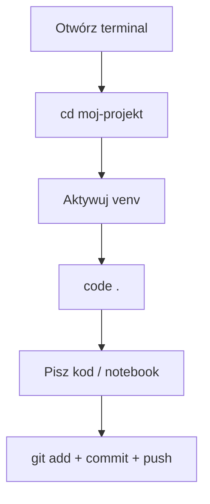
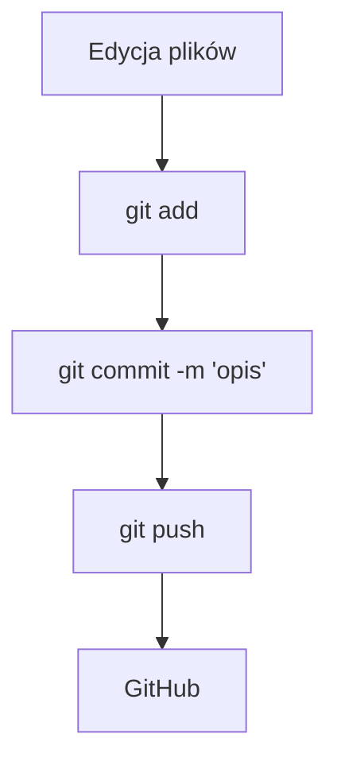
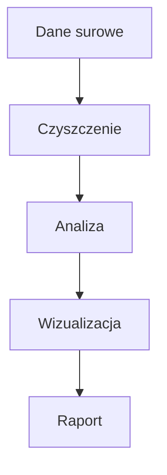
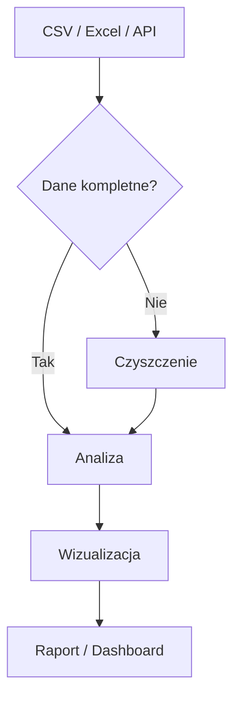
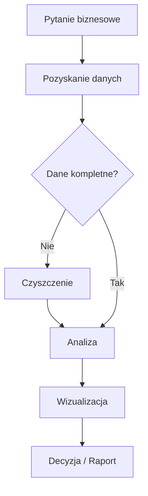

# Programowanie w języku Python II — Skrypt dla studentów

**Kierunek:** Analityka danych w biznesie
**Politechnika Opolska, Wydział Elektrotechniki, Automatyki i Informatyki**
**Autor:** dr hab. inż. Jarosław Zygarlicki

---

## Spis treści

1. [Warsztat pracy analityka](#1-warsztat-pracy-analityka)
2. [Wprowadzenie do analizy danych](#2-wprowadzenie-do-analizy-danych)
3. [NumPy — obliczenia numeryczne](#3-numpy--obliczenia-numeryczne)
4. [Pandas — przetwarzanie i analiza danych](#4-pandas--przetwarzanie-i-analiza-danych)
5. [Matplotlib — wizualizacja danych](#5-matplotlib--wizualizacja-danych)
6. [Statystyka w Pythonie](#6-statystyka-w-pythonie)
7. [Zaawansowane biblioteki i narzędzia](#7-zaawansowane-biblioteki-i-narzędzia)
8. [LLM i AI w analizie danych](#8-llm-i-ai-w-analizie-danych)

---

## 1. Warsztat pracy analityka

### 1.1 Środowisko pracy

W tym kursie korzystamy z profesjonalnych narzędzi stosowanych w branży analityki danych:

| Narzędzie | Do czego | Dlaczego |
|-----------|----------|----------|
| **Python 3.10+** | język programowania | standard w data science |
| **uv** | menedżer pakietów i venv | 10-100× szybszy od pip |
| **VS Code** | edytor + Jupyter + Git | standard branży, darmowy |
| **Git + GitHub** | kontrola wersji, portfolio | każda firma tego wymaga |

#### Instalacja Pythona

**Windows:**
1. Pobierz instalator z https://www.python.org/downloads/
2. **Zaznacz "Add Python to PATH"** — to krytyczne!
3. Kliknij "Install Now"

**Linux (Ubuntu/Debian):**
```bash
sudo apt update && sudo apt install python3 python3-venv python3-pip
```

Weryfikacja: `python --version` (Windows) lub `python3 --version` (Linux)

#### Instalacja uv

`uv` to ultraszybki menedżer pakietów od firmy Astral. Zastępuje `pip` + `venv` + `pyenv` jednym narzędziem.

**Windows (PowerShell):**
```powershell
powershell -ExecutionPolicy ByPass -c "irm https://astral.sh/uv/install.ps1 | iex"
```

**Linux / macOS:**
```bash
curl -LsSf https://astral.sh/uv/install.sh | sh
```

#### Instalacja VS Code

1. Pobierz z https://code.visualstudio.com/
2. Zainstaluj rozszerzenia (Ctrl+Shift+X):
   - **Python** (ms-python.python)
   - **Jupyter** (ms-toolsai.jupyter)
   - **GitLens** (eamodio.gitlens)

#### Instalacja Git

**Windows:** pobierz z https://git-scm.com/download/win (domyślne opcje OK)
**Linux:** `sudo apt install git`

Konfiguracja (jednorazowa):
```bash
git config --global user.name "Imię Nazwisko"
git config --global user.email "twoj@email.com"
```

#### Tworzenie projektu — pełny workflow

```bash
mkdir moj-projekt && cd moj-projekt   # utwórz katalog
git init                               # inicjalizuj Git
uv venv                                # utwórz środowisko wirtualne
source .venv/bin/activate              # aktywuj (Linux)
# .venv\Scripts\Activate.ps1           # aktywuj (Windows)
uv pip install numpy pandas matplotlib jupyter  # zainstaluj biblioteki
code .                                 # otwórz VS Code
```

#### Codzienny workflow



#### Najczęstsze problemy

| Problem | Rozwiązanie |
|---------|-------------|
| `python nie jest rozpoznawany` (Windows) | Reinstaluj z "Add to PATH" |
| `uv nie jest rozpoznawany` | Zamknij i otwórz ponownie terminal |
| Activate.ps1 nie działa | `Set-ExecutionPolicy RemoteSigned -Scope CurrentUser` |
| `No module named numpy` | Sprawdź czy aktywowałeś venv — `(.venv)` w prompcie |

### 1.2 Git i GitHub

#### Czym jest Git?

Git to **system kontroli wersji** — narzędzie, które śledzi każdą zmianę w twoich plikach. Zamiast tworzyć kopie (`raport_v1.docx`, `raport_final.docx`, `raport_naprawde_final.docx`), masz **jeden plik** i pełną historię zmian.

#### Podstawowe pojęcia

| Pojęcie | Znaczenie |
|---------|-----------|
| **Repozytorium (repo)** | Katalog śledzony przez Git |
| **Commit** | Migawka — zapisany stan projektu w danym momencie |
| **Staging area** | Poczekalnia — pliki przygotowane do commita |
| **Branch** | Gałąź — równoległa linia rozwoju kodu |
| **Remote** | Zdalne repozytorium (np. na GitHubie) |
| **Push** | Wypchnięcie commitów na zdalny serwer |
| **Pull** | Pobranie zmian ze zdalnego serwera |
| **Clone** | Skopiowanie zdalnego repozytorium na komputer |

#### Workflow Git — 3 komendy

```bash
git add plik.py          # 1. Dodaj plik do poczekalni
git commit -m "Opis"     # 2. Zapisz migawkę z opisem
git push                 # 3. Wyślij na GitHub
```



#### Tworzenie repozytorium od zera

```bash
mkdir moj-projekt
cd moj-projekt
git init
echo "# Mój projekt" > README.md
git add README.md
git commit -m "Pierwszy commit — dodaj README"
```

#### Łączenie z GitHubem

1. Na https://github.com kliknij **+** → **New repository**
2. Podaj nazwę, kliknij **Create repository**
3. W terminalu:

```bash
git remote add origin https://github.com/TWÓJ-LOGIN/moj-projekt.git
git push -u origin master
```

#### GitHub jako portfolio

GitHub to nie tylko miejsce na kod — to **twoje portfolio zawodowe**. Pracodawcy sprawdzają profile kandydatów na GitHubie. Dobrze utrzymane repozytorium z czytelnym README mówi więcej niż CV.

#### Dobre praktyki commitów

- Commituj **często** — małe, logiczne zmiany
- Pisz **zrozumiałe opisy**: `"Dodaj wykres sprzedaży kwartalnej"`, nie `"update"`
- Jeden commit = jedna logiczna zmiana
- **Nie commituj** plików tymczasowych, `.venv/`, `__pycache__/`

### 1.3 Markdown — dokumentacja projektów

#### Czym jest Markdown?

Markdown to prosty język znaczników. Piszesz zwykły tekst z kilkoma symbolami — a na GitHubie (i w VS Code) renderuje się jako profesjonalny, sformatowany dokument.

#### Podstawowa składnia

```markdown
# Nagłówek 1
## Nagłówek 2
### Nagłówek 3

Zwykły tekst. **Pogrubienie** i *kursywa*.

Lista punktowana:
- punkt 1
- punkt 2
- punkt 3

Lista numerowana:
1. pierwszy
2. drugi
3. trzeci

Link: [tekst linku](https://example.com)

Kod w linii: `print("hello")`

Blok kodu:
```python
import pandas as pd
df = pd.read_csv("dane.csv")
print(df.head())
```

Tabela:
| Kolumna A | Kolumna B |
|-----------|-----------|
| wartość 1 | wartość 2 |
```

#### Podgląd w VS Code

- `Ctrl+Shift+V` — podgląd w nowej karcie
- `Ctrl+K V` — podgląd obok kodu (side-by-side)

#### README.md — wizytówka projektu

Każde repozytorium powinno mieć `README.md`. GitHub automatycznie wyświetla ten plik na stronie głównej repo. Dobry README zawiera:

1. **Tytuł i opis** — co robi projekt
2. **Instalacja** — jak uruchomić
3. **Użycie** — przykłady
4. **Autor** — kto to napisał

### 1.4 Mermaid — diagramy w tekście

#### Czym jest Mermaid?

Mermaid to język do tworzenia diagramów **pisanych tekstem**. Nie potrzebujesz PowerPointa ani draw.io — piszesz kilka linii tekstu, a GitHub renderuje je jako profesjonalny diagram.

#### Diagram przepływu (flowchart)

````markdown

````

Renderuje się jako:


#### Kształty węzłów

| Składnia | Kształt |
|----------|---------|
| `A[tekst]` | prostokąt |
| `A(tekst)` | zaokrąglony prostokąt |
| `A{tekst}` | romb (decyzja) |
| `A([tekst])` | stadium |
| `A[[tekst]]` | podprogram |

#### Typy strzałek

| Składnia | Typ |
|----------|-----|
| `-->` | strzałka |
| `---` | linia bez strzałki |
| `-.->` | przerywana strzałka |
| `==>` | gruba strzałka |
| `-- tekst -->` | strzałka z etykietą |

#### Przykład: pipeline analizy danych

````markdown

````

#### Gdzie działa Mermaid?

- GitHub — automatycznie renderuje w plikach `.md`
- VS Code — z rozszerzeniem "Markdown Preview Mermaid Support"
- Jupyter Notebook — z odpowiednim rozszerzeniem
- Dokumentacja online (Notion, Confluence, itp.)

### 1.5 Zasady tworzenia kodu i struktury projektu

#### Struktura projektu analitycznego

```
moj-projekt/
├── README.md           # opis projektu
├── .gitignore          # pliki ignorowane przez Git
├── requirements.txt    # lista zależności
├── dane/               # pliki z danymi (CSV, Excel)
├── notebooki/          # Jupyter Notebooks (.ipynb)
├── src/                # skrypty Pythona (.py)
└── wyniki/             # wykresy, raporty
```

#### Plik .gitignore

Niektóre pliki **nie powinny** trafiać do repozytorium:

```
.venv/              # środowisko wirtualne
__pycache__/        # cache Pythona
*.pyc               # skompilowane pliki
.ipynb_checkpoints/ # checkpointy Jupyter
.DS_Store           # pliki macOS
```

#### Nazewnictwo

- Pliki: `analiza_sprzedazy.py` (snake_case, bez polskich znaków, bez spacji)
- Zmienne: `srednia_cena`, `lista_klientow` (snake_case)
- Stałe: `MAX_WIERSZY`, `SCIEZKA_DANYCH` (UPPER_SNAKE_CASE)
- Funkcje: `oblicz_srednia()`, `wczytaj_dane()` (snake_case, czasownik)

#### Komentarze i czytelność

```python
# Dobrze — komentarz wyjaśnia DLACZEGO
# Usuwamy wiersze z brakującymi cenami, bo zniekształcają średnią
df = df.dropna(subset=['cena'])

# Źle — komentarz mówi CO (to widać z kodu)
# Usuwamy wartości NaN
df = df.dropna(subset=['cena'])
```

#### Plik requirements.txt

Plik z listą zależności umożliwia odtworzenie środowiska:

```
numpy
pandas
matplotlib
seaborn
```

Instalacja: `uv pip install -r requirements.txt`

---

## 2. Wprowadzenie do analizy danych

### 2.1 Pipeline analityczny

Analiza danych to **proces** — sekwencja kroków od pytania biznesowego do decyzji.



#### Kroki pipeline'u

1. **Pytanie biznesowe** — "Który produkt sprzedaje się najlepiej w grudniu?" Bez pytania nie ma analizy.
2. **Pozyskanie danych** — CSV, Excel, baza danych, API, scraping.
3. **Czyszczenie danych** — brakujące wartości, duplikaty, błędne formaty. Zajmuje 60-80% czasu analityka.
4. **Analiza** — obliczenia, agregacje, grupowanie, statystyki.
5. **Wizualizacja** — wykresy, dashboardy. Ludzie lepiej rozumieją obrazy niż tabele.
6. **Decyzja / Raport** — odpowiedź na pytanie, rekomendacja dla biznesu.

#### Przykład: analiza napiwków w restauracji

```python
import pandas as pd
import matplotlib.pyplot as plt

# Krok 1-2: Wczytaj dane
df = pd.read_csv('https://raw.githubusercontent.com/mwaskom/seaborn-data/master/tips.csv')

# Krok 3: Poznaj dane
print(f"Rozmiar: {df.shape}")   # (244, 7)
print(df.head())                 # pierwsze 5 wierszy
print(df.describe())            # statystyki opisowe

# Krok 4: Odpowiedz na pytanie — który dzień przynosi najwyższe napiwki?
df.groupby('day')['tip'].mean().sort_values(ascending=False)
# Sun     3.26
# Sat     2.99
# Thur    2.77
# Fri     2.73

# Krok 5: Wizualizacja
df.groupby('day')['tip'].mean().plot(kind='bar', title='Średni napiwek wg dnia')
plt.ylabel('USD')
plt.tight_layout()
plt.show()

# Krok 6: Decyzja — w niedzielę i sobotę zatrudnić więcej kelnerów
```

### 2.2 Jupyter Notebook

Jupyter Notebook to interaktywne środowisko łączące **kod, tekst i wykresy** w jednym dokumencie. Idealny do eksploracji danych.

#### Komórki

Notebook składa się z komórek dwóch typów:
- **Code** — kod Pythona, uruchamiany przez `Shift+Enter`
- **Markdown** — tekst formatowany (nagłówki, listy, tabele)

#### Najważniejsze skróty

| Skrót | Co robi | Tryb |
|-------|---------|------|
| `Shift+Enter` | Uruchom komórkę, przejdź dalej | oba |
| `Ctrl+Enter` | Uruchom komórkę, zostań | oba |
| `Esc` | Tryb komend | — |
| `Enter` | Tryb edycji | — |
| `A` | Dodaj komórkę powyżej | komendy |
| `B` | Dodaj komórkę poniżej | komendy |
| `M` | Zmień na Markdown | komendy |
| `Y` | Zmień na Code | komendy |
| `DD` | Usuń komórkę | komendy |

#### Dobre praktyki

- **Naprzemiennie** komórki Code i Markdown — notebook to narracja, nie skrypt
- **Uruchamiaj od góry do dołu** — unikaj bałaganu z kolejnością
- Gdy się pogubisz: **Restart Kernel and Run All**
- Notebook wyświetla automatycznie wynik ostatniego wyrażenia (nie trzeba `print()`)

#### Przydatne funkcje

```python
# Autouzupełnianie: Tab po kropce
df.    # Tab → lista metod

# Dokumentacja: Shift+Tab
df.groupby    # Shift+Tab → docstring

# Mierzenie czasu wykonania
%timeit sum(range(1000))
```

### 2.3 Typy danych w kontekście analizy

#### Typy Pythona vs typy Pandas

| Typ Python | Typ Pandas/NumPy | Przykład | Kontekst biznesowy |
|-----------|------------------|---------|-------------------|
| `int` | `int64` | 42 | ilości, ID, liczba sztuk |
| `float` | `float64` | 19.99 | ceny, kwoty, wyniki |
| `str` | `object` | "Laptop" | nazwy, kategorie, opisy |
| `bool` | `bool` | True | flagi (aktywny, zapłacone) |
| — | `datetime64` | 2026-01-15 | daty zamówień, rejestracji |

```python
# Sprawdzenie typów w DataFrame
df.dtypes
# total_bill    float64
# tip           float64
# sex            object
# smoker         object
# day            object
# time           object
# size            int64
```

#### Problem brakujących danych

W realnych danych **zawsze** czegoś brakuje. Listy Pythona nie mają mechanizmu obsługi braków — Pandas ma `NaN` (Not a Number) i dedykowane metody:

```python
df.info()         # pokaże ile wartości nie-null w każdej kolumnie
df.isna().sum()   # policz brakujące wartości
df.dropna()       # usuń wiersze z brakami
df.fillna(0)      # zastąp braki wartością
```

### 2.4 Źródła danych w biznesie

| Źródło | Format | Jak wczytać w Pandas |
|--------|--------|---------------------|
| Arkusze kalkulacyjne | CSV, Excel | `pd.read_csv()`, `pd.read_excel()` |
| Bazy danych | SQL | `pd.read_sql()` |
| API internetowe | JSON | `pd.read_json()`, `requests` |
| Pliki logów | JSON, tekst | `pd.read_json()`, parsowanie |
| Big Data | Parquet | `pd.read_parquet()` |

### 2.5 Dlaczego listy Pythona nie wystarczają

```python
import numpy as np
import time

# Milion wartości
lista = list(range(1_000_000))
tablica = np.array(lista)

# Pomnóż przez 2
start = time.perf_counter()
wynik_lista = [x * 2 for x in lista]
czas_lista = time.perf_counter() - start

start = time.perf_counter()
wynik_numpy = tablica * 2
czas_numpy = time.perf_counter() - start

print(f"Lista:  {czas_lista*1000:.1f} ms")
print(f"NumPy:  {czas_numpy*1000:.1f} ms")
# NumPy jest ~10-20× szybszy!
```

**Dlaczego?** Lista Pythona przechowuje każdy element jako osobny obiekt rozrzucony po pamięci. NumPy przechowuje dane w **ciągłym bloku pamięci** i korzysta z zoptymalizowanych instrukcji procesora (SIMD). To fundament, na którym stoi Pandas i cały ekosystem data science.

---

## 3. NumPy — obliczenia numeryczne

### 3.1 Czym jest NumPy?

NumPy (Numerical Python) to fundament ekosystemu data science w Pythonie. Pandas, Matplotlib, scikit-learn — wszystkie te biblioteki pod spodem korzystają z NumPy. Kluczowa struktura danych to **ndarray** (n-dimensional array) — tablica n-wymiarowa.

### 3.2 Tworzenie tablic

```python
import numpy as np    # konwencja — zawsze np

# Z listy
a = np.array([10, 20, 30, 40, 50])

# Zera i jedynki
zera = np.zeros(5)              # [0, 0, 0, 0, 0]
jedynki = np.ones((3, 4))      # macierz 3×4 wypełniona jedynkami

# Sekwencje
sekwencja = np.arange(0, 10, 2)     # [0, 2, 4, 6, 8] — jak range()
rownomierne = np.linspace(0, 1, 5)  # [0, 0.25, 0.5, 0.75, 1] — 5 punktów

# Losowe
losowe = np.random.randint(1, 100, size=10)   # 10 losowych int z [1, 100)
normalne = np.random.randn(5)                  # 5 wartości z rozkładu normalnego

np.random.seed(42)    # ustawienie ziarna — wyniki powtarzalne
```

### 3.3 Atrybuty tablicy

```python
m = np.array([[1, 2, 3], [4, 5, 6]])

m.shape    # (2, 3) — 2 wiersze, 3 kolumny
m.ndim     # 2 — dwa wymiary
m.size     # 6 — łączna liczba elementów
m.dtype    # int64 — typ danych
```

### 3.4 Indeksowanie i slicing

#### Tablica 1D

```python
dane = np.array([10, 20, 30, 40, 50, 60, 70, 80, 90, 100])

dane[0]       # 10 — pierwszy element
dane[-1]      # 100 — ostatni
dane[2:5]     # [30, 40, 50] — od indeksu 2 do 5 (bez 5!)
dane[:3]      # [10, 20, 30] — pierwsze 3
dane[7:]      # [80, 90, 100] — od indeksu 7
dane[::2]     # [10, 30, 50, 70, 90] — co drugi
dane[::-1]    # odwrócona tablica
```

#### Tablica 2D

```python
macierz = np.array([[1, 2, 3],
                     [4, 5, 6],
                     [7, 8, 9]])

macierz[0, 1]     # 2 — wiersz 0, kolumna 1
macierz[1]        # [4, 5, 6] — cały wiersz 1
macierz[:, 0]     # [1, 4, 7] — cała kolumna 0
macierz[1:, 1:]   # [[5, 6], [8, 9]] — fragment
```

**Zapamiętaj:** `[wiersz, kolumna]`. Dwukropek `:` sam = "wszystko".

### 3.5 Operacje wektorowe

Operacje na tablicach NumPy działają na **wszystkich elementach naraz** — bez pętli.

```python
ceny = np.array([100, 200, 150, 300, 250])

# Arytmetyka
ceny * 0.9          # rabat 10%: [90, 180, 135, 270, 225]
ceny * 1.23         # VAT 23%
ceny + 50           # podwyżka o 50 zł

# Agregacje
ceny.sum()          # 1000
ceny.mean()         # 200.0
ceny.std()          # 70.71
ceny.min()          # 100
ceny.max()          # 300
ceny.argmax()       # 3 — INDEKS maksymalnego elementu

# Operacje między tablicami
ilosci = np.array([5, 3, 10, 2, 7])
wartosc = ceny * ilosci    # element po elemencie
obrot = wartosc.sum()      # łączny obrót
```

### 3.6 Filtrowanie boolean

```python
ceny = np.array([100, 200, 150, 300, 250])

ceny > 200              # [False, False, False, True, True]
ceny[ceny > 200]        # [300, 250] — tylko drogie produkty
(ceny > 200).sum()      # 2 — ile jest drogich
```

**Zasada:** Warunek tworzy tablicę True/False. Użycie jej jako indeksu filtruje dane. True = 1, False = 0 — stąd `.sum()` liczy ile spełnia warunek.

### 3.7 Parametr axis

W tablicach 2D `axis` określa kierunek operacji:

```python
dane = np.array([[10, 20, 30],    # wiersz 0
                  [40, 50, 60]])   # wiersz 1

dane.sum(axis=0)    # [50, 70, 90] — suma "w dół" (per kolumna)
dane.sum(axis=1)    # [60, 150] — suma "w prawo" (per wiersz)
dane.sum()          # 210 — suma wszystkich
```

**Zapamiętaj:** `axis=0` = w dół, `axis=1` = w prawo.

### 3.8 Broadcasting

Broadcasting pozwala operować na tablicach **różnych kształtów**. NumPy automatycznie "rozciąga" mniejszą tablicę.

```python
# Macierz 3×4 * skalar → każdy element × skalar
ceny = np.array([[100, 110, 120, 130],
                  [200, 210, 220, 230],
                  [50,  55,  60,  65]])
ceny * 1.23     # VAT na wszystko

# Macierz 3×4 * wektor (4,) → wektor rozciągnięty na 3 wiersze
rabat = np.array([0.05, 0.10, 0.15, 0.20])
ceny * (1 - rabat)   # inny rabat per kwartał

# Macierz 3×4 * wektor kolumnowy (3,1) → kolumna rozciągnięta na 4 kolumny
premia = np.array([[1.2], [1.0], [1.5]])
ceny * premia   # inna premia per produkt
```

**Zasada:** NumPy porównuje kształty od prawej. Wymiar musi być **taki sam** lub **równy 1**.

### 3.9 Zmiana kształtu tablic

```python
a = np.arange(12)           # [0, 1, 2, ..., 11]
a.reshape(3, 4)             # macierz 3×4
a.reshape(3, -1)            # -1 = oblicz sam → 3×4

macierz = np.array([[1, 2], [3, 4]])
macierz.flatten()           # [1, 2, 3, 4] — spłaszcza do 1D

# Łączenie tablic
np.vstack([a, b])           # pionowo (wiersze pod sobą)
np.hstack([a, b])           # poziomo (obok siebie)
np.column_stack([a, b])     # jako kolumny
```

### 3.10 Zaawansowane operacje

```python
# np.where — warunkowe przypisanie (jak IF w Excelu)
status = np.where(oceny >= 3.0, 'ZDAŁ', 'NIE ZDAŁ')

# Sortowanie
np.sort(dane)               # posortowana kopia
np.argsort(dane)            # indeksy sortowania (do rankingów!)

# Unikalne wartości
unikalne, ile = np.unique(kategorie, return_counts=True)

# Korelacja Pearsona
r = np.corrcoef(x, y)[0, 1]  # wartość od -1 do 1

# Percentyle i IQR
np.percentile(dane, 25)      # Q1
np.percentile(dane, 75)      # Q3
np.median(dane)               # mediana (Q2)
```

### 3.11 Generowanie danych

```python
np.random.seed(42)           # powtarzalność wyników

np.random.normal(loc=5000, scale=1000, size=100)  # rozkład normalny
np.random.uniform(low=10, high=500, size=50)       # rozkład jednostajny
np.random.randint(1, 100, size=20)                 # losowe int
np.random.poisson(lam=20, size=30)                 # rozkład Poissona
```

---

## 4. Pandas — przetwarzanie i analiza danych

### 4.1 Czym jest Pandas?

Pandas to **najważniejsza biblioteka** w ekosystemie analizy danych w Pythonie. Pod spodem korzysta z NumPy, ale dodaje etykiety, nazwy kolumn i dziesiątki wygodnych metod do pracy z danymi tabelarycznymi.

```python
import pandas as pd    # konwencja — zawsze pd
```

Dwie kluczowe struktury danych:
- **Series** — jednowymiarowa tablica z etykietami (jak kolumna w Excelu)
- **DataFrame** — dwuwymiarowa tabela z wierszami i kolumnami (jak arkusz)

### 4.2 Series

Series to tablica NumPy + indeks (etykiety).

```python
# Z listy — domyślny indeks (0, 1, 2, ...)
oceny = pd.Series([4.5, 3.0, 5.0, 3.5, 4.0])

# Z dict — klucze stają się indeksem
pensje = pd.Series({
    'Anna': 5500,
    'Jan': 7200,
    'Marek': 9100
})

# Z etykietami
sprzedaz = pd.Series(
    [340, 120, 560],
    index=['Laptop', 'Tablet', 'Smartfon']
)
```

#### Dostęp do elementów

```python
pensje['Anna']        # po etykiecie → 5500
pensje.iloc[0]        # po pozycji → 5500
pensje[:2]            # slice — pierwsze 2
```

#### Operacje na Series

```python
# Operacje wektorowe — jak NumPy
pensje * 1.10              # podwyżka 10%
pensje[pensje > 6000]      # filtrowanie boolean

# Agregacje
pensje.mean()              # średnia
pensje.sum()               # suma
pensje.max()               # wartość max
pensje.idxmax()            # ETYKIETA max (nie indeks jak w NumPy!)
```

### 4.3 DataFrame

DataFrame to tabela — kolekcja Series o wspólnym indeksie.

```python
# Tworzenie z dict list
dane = pd.DataFrame({
    'produkt': ['Laptop', 'Tablet', 'Smartfon'],
    'cena': [3500, 1800, 2500],
    'sprzedaz': [340, 120, 560]
})
```

#### Podstawowe atrybuty

```python
dane.shape      # (3, 3) — wiersze × kolumny
dane.columns    # nazwy kolumn
dane.index      # indeks wierszy
dane.dtypes     # typy danych w kolumnach
dane.size       # łączna liczba elementów
dane.ndim       # 2 (dwuwymiarowy)
```

### 4.4 Wczytywanie danych

```python
# Z pliku CSV
df = pd.read_csv('dane.csv')

# Z URL
df = pd.read_csv('https://example.com/dane.csv')

# Z Excela
df = pd.read_excel('dane.xlsx')

# Przydatne parametry read_csv:
pd.read_csv('dane.csv', sep=';')           # separator ;
pd.read_csv('dane.csv', encoding='utf-8')  # kodowanie
pd.read_csv('dane.csv', index_col=0)       # pierwsza kolumna jako indeks
```

### 4.5 Eksploracja danych (EDA)

Pierwsze 5 minut z każdym nowym datasetem — **Exploratory Data Analysis**.

```python
df.head()          # pierwsze 5 wierszy
df.head(10)        # pierwsze 10
df.tail()          # ostatnie 5
df.sample(3)       # losowe 3 wiersze

df.shape           # rozmiar (wiersze, kolumny)
df.dtypes          # typy danych
df.info()          # RTG danych: typy, braki, pamięć
df.describe()      # statystyki kolumn liczbowych
df.describe(include='all')  # wszystkich kolumn
```

#### Sprawdzenie braków

```python
df.isna().sum()           # braki w każdej kolumnie
df.isna().sum().sum()     # łączna liczba braków
df.isna().any(axis=1).sum()  # ile wierszy ma jakikolwiek brak
```

### 4.6 Rozkłady wartości

```python
# Ile razy każda wartość wystąpiła
df['kolumna'].value_counts()

# Procenty zamiast liczebności
df['kolumna'].value_counts(normalize=True)

# Unikalne wartości
df['kolumna'].unique()       # tablica unikalnych
df['kolumna'].nunique()      # ile unikalnych
```

### 4.7 Selekcja kolumn

```python
# Jedna kolumna → Series
rachunki = df['total_bill']

# Wiele kolumn → DataFrame (podwójne nawiasy!)
pieniadze = df[['total_bill', 'tip']]
```

**Zapamiętaj:** `df['x']` → Series. `df[['x', 'y']]` → DataFrame (wewnątrz jest lista).

### 4.8 Tworzenie nowych kolumn

```python
# Obliczenie z istniejących kolumn
df['tip_pct'] = (df['tip'] / df['total_bill'] * 100).round(1)
df['wartosc'] = df['cena'] * df['ilosc']
```

### 4.9 Pandas a NumPy

```python
# Pod spodem to NumPy
wartosci = df['total_bill'].values    # numpy.ndarray
print(type(wartosci))                  # <class 'numpy.ndarray'>

# Funkcje NumPy działają na kolumnach Pandas
np.median(df['total_bill'])    # działa
df['total_bill'].median()     # ale to jest wygodniejsze
```

| Cecha | NumPy | Pandas |
|-------|-------|--------|
| Struktura | ndarray | Series / DataFrame |
| Indeks | pozycyjny (0, 1, 2) | etykiety (nazwy, daty) |
| Typy w kolumnie | jeden typ | jeden typ |
| Typy między kolumnami | jeden typ | różne typy |
| Brakujące dane | brak natywnego wsparcia | NaN + metody (isna, fillna, dropna) |
| Wczytywanie plików | np.loadtxt (ograniczone) | read_csv, read_excel, read_sql |
| Szybkość obliczeń | najszybszy | nieco wolniejszy (etykiety kosztują) |

---

## 5. Matplotlib — wizualizacja danych

*(treść będzie uzupełniana)*

---

## 6. Statystyka w Pythonie

*(treść będzie uzupełniana)*

---

## 7. Zaawansowane biblioteki i narzędzia

*(treść będzie uzupełniana)*

---

## 8. LLM i AI w analizie danych

*(treść będzie uzupełniana)*
