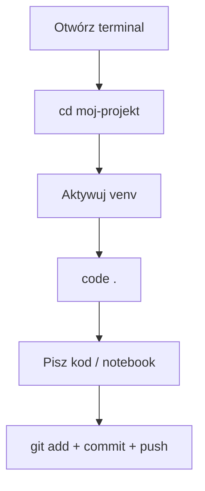
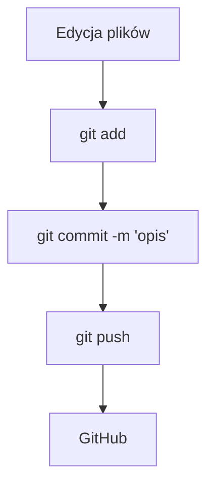
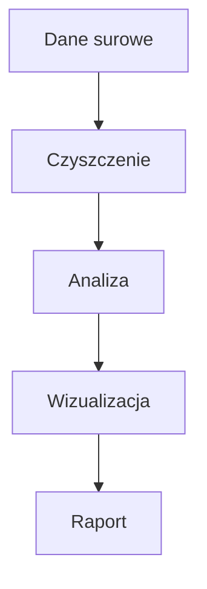
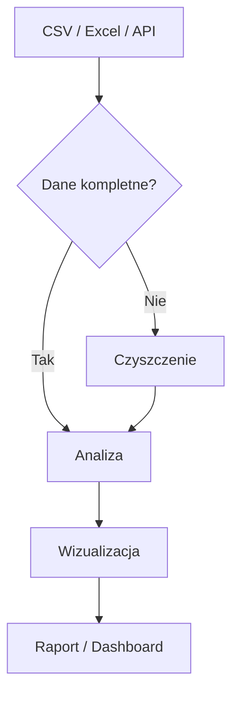
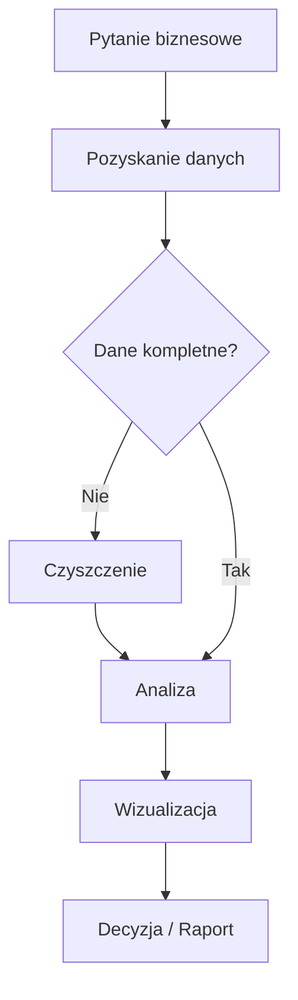
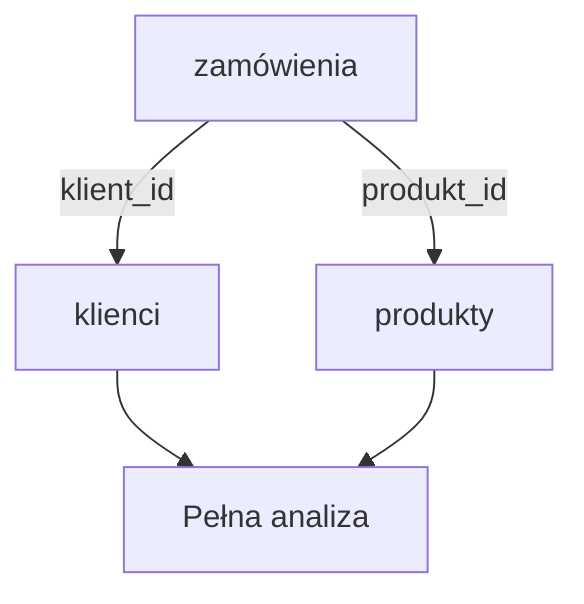

# Programowanie w języku Python II — Skrypt dla studentów

**Kierunek:** Analityka danych w biznesie
**Politechnika Opolska, Wydział Elektrotechniki, Automatyki i Informatyki**
**Autor:** dr hab. inż. Jarosław Zygarlicki

---

## Spis treści

1. [Warsztat pracy analityka](#1-warsztat-pracy-analityka)
2. [Wprowadzenie do analizy danych](#2-wprowadzenie-do-analizy-danych)
3. [NumPy — obliczenia numeryczne](#3-numpy--obliczenia-numeryczne)
4. [Pandas — przetwarzanie i analiza danych](#4-pandas--przetwarzanie-i-analiza-danych)
5. [Matplotlib — wizualizacja danych](#5-matplotlib--wizualizacja-danych)
6. [Statystyka w Pythonie](#6-statystyka-w-pythonie)
7. [Zaawansowane biblioteki i narzędzia](#7-zaawansowane-biblioteki-i-narzędzia)
8. [LLM i AI w analizie danych](#8-llm-i-ai-w-analizie-danych)

---

## 1. Warsztat pracy analityka

> **Dokumentacja i materiały źródłowe:**
> - [Python — oficjalna strona](https://www.python.org/)
> - [uv — dokumentacja](https://docs.astral.sh/uv/)
> - [VS Code — Python Tutorial](https://code.visualstudio.com/docs/python/python-tutorial)
> - [Git — oficjalny podręcznik (po polsku)](https://git-scm.com/book/pl/v2)
> - [GitHub — Getting Started](https://docs.github.com/en/get-started/quickstart)
> - [Markdown Guide](https://www.markdownguide.org/)
> - [Mermaid — dokumentacja](https://mermaid.js.org/intro/)

### 1.1 Środowisko pracy

W tym kursie korzystamy z profesjonalnych narzędzi stosowanych w branży analityki danych:

| Narzędzie | Do czego | Dlaczego |
|-----------|----------|----------|
| **Python 3.10+** | język programowania | standard w data science |
| **uv** | menedżer pakietów i venv | 10-100× szybszy od pip |
| **VS Code** | edytor + Jupyter + Git | standard branży, darmowy |
| **Git + GitHub** | kontrola wersji, portfolio | każda firma tego wymaga |

#### Instalacja Pythona

**Windows:**
1. Pobierz instalator z https://www.python.org/downloads/
2. **Zaznacz "Add Python to PATH"** — to krytyczne!
3. Kliknij "Install Now"

**Linux (Ubuntu/Debian):**
```bash
sudo apt update && sudo apt install python3 python3-venv python3-pip
```

Weryfikacja: `python --version` (Windows) lub `python3 --version` (Linux)

#### Instalacja uv

`uv` to ultraszybki menedżer pakietów od firmy Astral. Zastępuje `pip` + `venv` + `pyenv` jednym narzędziem.

**Windows (PowerShell):**
```powershell
powershell -ExecutionPolicy ByPass -c "irm https://astral.sh/uv/install.ps1 | iex"
```

**Linux / macOS:**
```bash
curl -LsSf https://astral.sh/uv/install.sh | sh
```

#### Instalacja VS Code

1. Pobierz z https://code.visualstudio.com/
2. Zainstaluj rozszerzenia (Ctrl+Shift+X):
   - **Python** (ms-python.python)
   - **Jupyter** (ms-toolsai.jupyter)
   - **GitLens** (eamodio.gitlens)

#### Instalacja Git

**Windows:** pobierz z https://git-scm.com/download/win (domyślne opcje OK)
**Linux:** `sudo apt install git`

Konfiguracja (jednorazowa):
```bash
git config --global user.name "Imię Nazwisko"
git config --global user.email "twoj@email.com"
```

#### Tworzenie projektu — pełny workflow

```bash
mkdir moj-projekt && cd moj-projekt   # utwórz katalog
git init                               # inicjalizuj Git
uv venv                                # utwórz środowisko wirtualne
source .venv/bin/activate              # aktywuj (Linux)
# .venv\Scripts\Activate.ps1           # aktywuj (Windows)
uv pip install numpy pandas matplotlib jupyter  # zainstaluj biblioteki
code .                                 # otwórz VS Code
```

#### Codzienny workflow



#### Najczęstsze problemy

| Problem | Rozwiązanie |
|---------|-------------|
| `python nie jest rozpoznawany` (Windows) | Reinstaluj z "Add to PATH" |
| `uv nie jest rozpoznawany` | Zamknij i otwórz ponownie terminal |
| Activate.ps1 nie działa | `Set-ExecutionPolicy RemoteSigned -Scope CurrentUser` |
| `No module named numpy` | Sprawdź czy aktywowałeś venv — `(.venv)` w prompcie |

### 1.2 Git i GitHub

#### Czym jest Git?

Git to **system kontroli wersji** — narzędzie, które śledzi każdą zmianę w twoich plikach. Zamiast tworzyć kopie (`raport_v1.docx`, `raport_final.docx`, `raport_naprawde_final.docx`), masz **jeden plik** i pełną historię zmian.

#### Podstawowe pojęcia

| Pojęcie | Znaczenie |
|---------|-----------|
| **Repozytorium (repo)** | Katalog śledzony przez Git |
| **Commit** | Migawka — zapisany stan projektu w danym momencie |
| **Staging area** | Poczekalnia — pliki przygotowane do commita |
| **Branch** | Gałąź — równoległa linia rozwoju kodu |
| **Remote** | Zdalne repozytorium (np. na GitHubie) |
| **Push** | Wypchnięcie commitów na zdalny serwer |
| **Pull** | Pobranie zmian ze zdalnego serwera |
| **Clone** | Skopiowanie zdalnego repozytorium na komputer |

#### Workflow Git — 3 komendy

```bash
git add plik.py          # 1. Dodaj plik do poczekalni
git commit -m "Opis"     # 2. Zapisz migawkę z opisem
git push                 # 3. Wyślij na GitHub
```



#### Tworzenie repozytorium od zera

```bash
mkdir moj-projekt
cd moj-projekt
git init
echo "# Mój projekt" > README.md
git add README.md
git commit -m "Pierwszy commit — dodaj README"
```

#### Łączenie z GitHubem

1. Na https://github.com kliknij **+** → **New repository**
2. Podaj nazwę, kliknij **Create repository**
3. W terminalu:

```bash
git remote add origin https://github.com/TWÓJ-LOGIN/moj-projekt.git
git push -u origin master
```

#### GitHub jako portfolio

GitHub to nie tylko miejsce na kod — to **twoje portfolio zawodowe**. Pracodawcy sprawdzają profile kandydatów na GitHubie. Dobrze utrzymane repozytorium z czytelnym README mówi więcej niż CV.

#### Dobre praktyki commitów

- Commituj **często** — małe, logiczne zmiany
- Pisz **zrozumiałe opisy**: `"Dodaj wykres sprzedaży kwartalnej"`, nie `"update"`
- Jeden commit = jedna logiczna zmiana
- **Nie commituj** plików tymczasowych, `.venv/`, `__pycache__/`

### 1.3 Jak pracować na laboratoriach

Przez cały semestr pracujesz w **jednym repozytorium** na GitHubie. Prowadzący ma do niego wgląd na bieżąco.

#### Struktura repozytorium

```
python2-lab/
├── README.md              ← wizytówka (opis + spis laboratoriów)
├── .gitignore
├── requirements.txt
├── lab01/                 ← folder per laboratorium
│   └── lab01_setup.ipynb
├── lab02/
│   └── lab02_pipeline.ipynb
├── ...
└── projekt/               ← mini-projekt (koniec semestru)
    ├── README.md
    ├── dane.csv
    └── analiza.ipynb
```

#### Workflow każdego laboratorium

```
1. cd ~/python2-lab && source .venv/bin/activate
2. code .                          ← otwórz VS Code
3. Pracuj w folderze labXX/        ← notebook z ćwiczeniami
4. Commituj po KAŻDYM ćwiczeniu    ← nie na koniec!
5. git push na koniec zajęć
6. Sprawdź na GitHubie czy widać
```

#### Commitowanie — regularnie, nie na koniec

```bash
# Po ćwiczeniu 1:
git add lab03/lab03_numpy.ipynb
git commit -m "L03: Ćw. 1 — tworzenie tablic NumPy"

# Po ćwiczeniu 2:
git add lab03/lab03_numpy.ipynb
git commit -m "L03: Ćw. 2 — operacje wektorowe"

# Na koniec labu:
git push
```

Prowadzący widzi Twoją historię commitów. Pięć commitów = "student pracował krok po kroku". Jeden commit z wszystkim = "student skopiował na koniec".

#### Udostępnianie prowadzącemu

- **Repo publiczne (zalecane):** prowadzący wchodzi pod `github.com/TWÓJ-LOGIN/python2-lab`
- **Repo prywatne:** Settings → Collaborators → Add → login prowadzącego (**sp6jaz**)

#### Przed commitem: uruchom notebook

```
Restart & Run All → Ctrl+S → git add → git commit → git push
```

GitHub renderuje `.ipynb` — prowadzący widzi kod, wyniki i wykresy w przeglądarce bez uruchamiania.

### 1.4 Markdown — dokumentacja projektów

#### Czym jest Markdown?

Markdown to prosty język znaczników. Piszesz zwykły tekst z kilkoma symbolami — a na GitHubie (i w VS Code) renderuje się jako profesjonalny, sformatowany dokument.

#### Podstawowa składnia

```markdown
# Nagłówek 1
## Nagłówek 2
### Nagłówek 3

Zwykły tekst. **Pogrubienie** i *kursywa*.

Lista punktowana:
- punkt 1
- punkt 2
- punkt 3

Lista numerowana:
1. pierwszy
2. drugi
3. trzeci

Link: [tekst linku](https://example.com)

Kod w linii: `print("hello")`

Blok kodu:
```python
import pandas as pd
df = pd.read_csv("dane.csv")
print(df.head())
```

Tabela:
| Kolumna A | Kolumna B |
|-----------|-----------|
| wartość 1 | wartość 2 |
```

#### Podgląd w VS Code

- `Ctrl+Shift+V` — podgląd w nowej karcie
- `Ctrl+K V` — podgląd obok kodu (side-by-side)

#### README.md — wizytówka projektu

Każde repozytorium powinno mieć `README.md`. GitHub automatycznie wyświetla ten plik na stronie głównej repo. Dobry README zawiera:

1. **Tytuł i opis** — co robi projekt
2. **Instalacja** — jak uruchomić
3. **Użycie** — przykłady
4. **Autor** — kto to napisał

### 1.5 Mermaid — diagramy w tekście

#### Czym jest Mermaid?

Mermaid to język do tworzenia diagramów **pisanych tekstem**. Nie potrzebujesz PowerPointa ani draw.io — piszesz kilka linii tekstu, a GitHub renderuje je jako profesjonalny diagram.

#### Diagram przepływu (flowchart)

````markdown

````

Renderuje się jako:


#### Kształty węzłów

| Składnia | Kształt |
|----------|---------|
| `A[tekst]` | prostokąt |
| `A(tekst)` | zaokrąglony prostokąt |
| `A{tekst}` | romb (decyzja) |
| `A([tekst])` | stadium |
| `A[[tekst]]` | podprogram |

#### Typy strzałek

| Składnia | Typ |
|----------|-----|
| `-->` | strzałka |
| `---` | linia bez strzałki |
| `-.->` | przerywana strzałka |
| `==>` | gruba strzałka |
| `-- tekst -->` | strzałka z etykietą |

#### Przykład: pipeline analizy danych

````markdown

````

#### Gdzie działa Mermaid?

- GitHub — automatycznie renderuje w plikach `.md`
- VS Code — z rozszerzeniem "Markdown Preview Mermaid Support"
- Jupyter Notebook — z odpowiednim rozszerzeniem
- Dokumentacja online (Notion, Confluence, itp.)

### 1.6 Zasady tworzenia kodu i struktury projektu

#### Struktura projektu analitycznego

```
moj-projekt/
├── README.md           # opis projektu
├── .gitignore          # pliki ignorowane przez Git
├── requirements.txt    # lista zależności
├── dane/               # pliki z danymi (CSV, Excel)
├── notebooki/          # Jupyter Notebooks (.ipynb)
├── src/                # skrypty Pythona (.py)
└── wyniki/             # wykresy, raporty
```

#### Plik .gitignore

Niektóre pliki **nie powinny** trafiać do repozytorium:

```
.venv/              # środowisko wirtualne
__pycache__/        # cache Pythona
*.pyc               # skompilowane pliki
.ipynb_checkpoints/ # checkpointy Jupyter
.DS_Store           # pliki macOS
```

#### Nazewnictwo

- Pliki: `analiza_sprzedazy.py` (snake_case, bez polskich znaków, bez spacji)
- Zmienne: `srednia_cena`, `lista_klientow` (snake_case)
- Stałe: `MAX_WIERSZY`, `SCIEZKA_DANYCH` (UPPER_SNAKE_CASE)
- Funkcje: `oblicz_srednia()`, `wczytaj_dane()` (snake_case, czasownik)

#### Komentarze i czytelność

```python
# Dobrze — komentarz wyjaśnia DLACZEGO
# Usuwamy wiersze z brakującymi cenami, bo zniekształcają średnią
df = df.dropna(subset=['cena'])

# Źle — komentarz mówi CO (to widać z kodu)
# Usuwamy wartości NaN
df = df.dropna(subset=['cena'])
```

#### Plik requirements.txt

Plik z listą zależności umożliwia odtworzenie środowiska:

```
numpy
pandas
matplotlib
seaborn
```

Instalacja: `uv pip install -r requirements.txt`

---

## 2. Wprowadzenie do analizy danych

> **Dokumentacja i materiały źródłowe:**
> - [Jupyter Notebook — dokumentacja](https://jupyter-notebook.readthedocs.io/en/stable/)
> - [Python — typy wbudowane](https://docs.python.org/3/library/stdtypes.html)
> - [Pandas — 10 Minutes to Pandas](https://pandas.pydata.org/docs/user_guide/10min.html)
> - [Real Python — Data Science Tutorials](https://realpython.com/tutorials/data-science/)

### 2.1 Pipeline analityczny

Analiza danych to **proces** — sekwencja kroków od pytania biznesowego do decyzji.



#### Kroki pipeline'u

1. **Pytanie biznesowe** — "Który produkt sprzedaje się najlepiej w grudniu?" Bez pytania nie ma analizy.
2. **Pozyskanie danych** — CSV, Excel, baza danych, API, scraping.
3. **Czyszczenie danych** — brakujące wartości, duplikaty, błędne formaty. Zajmuje 60-80% czasu analityka.
4. **Analiza** — obliczenia, agregacje, grupowanie, statystyki.
5. **Wizualizacja** — wykresy, dashboardy. Ludzie lepiej rozumieją obrazy niż tabele.
6. **Decyzja / Raport** — odpowiedź na pytanie, rekomendacja dla biznesu.

#### Przykład: analiza napiwków w restauracji

```python
import pandas as pd
import matplotlib.pyplot as plt

# Krok 1-2: Wczytaj dane
df = pd.read_csv('https://raw.githubusercontent.com/mwaskom/seaborn-data/master/tips.csv')

# Krok 3: Poznaj dane
print(f"Rozmiar: {df.shape}")   # (244, 7)
print(df.head())                 # pierwsze 5 wierszy
print(df.describe())            # statystyki opisowe

# Krok 4: Odpowiedz na pytanie — który dzień przynosi najwyższe napiwki?
df.groupby('day')['tip'].mean().sort_values(ascending=False)
# Sun     3.26
# Sat     2.99
# Thur    2.77
# Fri     2.73

# Krok 5: Wizualizacja
df.groupby('day')['tip'].mean().plot(kind='bar', title='Średni napiwek wg dnia')
plt.ylabel('USD')
plt.tight_layout()
plt.show()

# Krok 6: Decyzja — w niedzielę i sobotę zatrudnić więcej kelnerów
```

### 2.2 Jupyter Notebook

Jupyter Notebook to interaktywne środowisko łączące **kod, tekst i wykresy** w jednym dokumencie. Idealny do eksploracji danych.

#### Komórki

Notebook składa się z komórek dwóch typów:
- **Code** — kod Pythona, uruchamiany przez `Shift+Enter`
- **Markdown** — tekst formatowany (nagłówki, listy, tabele)

#### Najważniejsze skróty

| Skrót | Co robi | Tryb |
|-------|---------|------|
| `Shift+Enter` | Uruchom komórkę, przejdź dalej | oba |
| `Ctrl+Enter` | Uruchom komórkę, zostań | oba |
| `Esc` | Tryb komend | — |
| `Enter` | Tryb edycji | — |
| `A` | Dodaj komórkę powyżej | komendy |
| `B` | Dodaj komórkę poniżej | komendy |
| `M` | Zmień na Markdown | komendy |
| `Y` | Zmień na Code | komendy |
| `DD` | Usuń komórkę | komendy |

#### Dobre praktyki

- **Naprzemiennie** komórki Code i Markdown — notebook to narracja, nie skrypt
- **Uruchamiaj od góry do dołu** — unikaj bałaganu z kolejnością
- Gdy się pogubisz: **Restart Kernel and Run All**
- Notebook wyświetla automatycznie wynik ostatniego wyrażenia (nie trzeba `print()`)

#### Przydatne funkcje

```python
# Autouzupełnianie: Tab po kropce
df.    # Tab → lista metod

# Dokumentacja: Shift+Tab
df.groupby    # Shift+Tab → docstring

# Mierzenie czasu wykonania
%timeit sum(range(1000))
```

### 2.3 Typy danych w kontekście analizy

#### Typy Pythona vs typy Pandas

| Typ Python | Typ Pandas/NumPy | Przykład | Kontekst biznesowy |
|-----------|------------------|---------|-------------------|
| `int` | `int64` | 42 | ilości, ID, liczba sztuk |
| `float` | `float64` | 19.99 | ceny, kwoty, wyniki |
| `str` | `object` | "Laptop" | nazwy, kategorie, opisy |
| `bool` | `bool` | True | flagi (aktywny, zapłacone) |
| — | `datetime64` | 2026-01-15 | daty zamówień, rejestracji |

```python
# Sprawdzenie typów w DataFrame
df.dtypes
# total_bill    float64
# tip           float64
# sex            object
# smoker         object
# day            object
# time           object
# size            int64
```

#### Problem brakujących danych

W realnych danych **zawsze** czegoś brakuje. Listy Pythona nie mają mechanizmu obsługi braków — Pandas ma `NaN` (Not a Number) i dedykowane metody:

```python
df.info()         # pokaże ile wartości nie-null w każdej kolumnie
df.isna().sum()   # policz brakujące wartości
df.dropna()       # usuń wiersze z brakami
df.fillna(0)      # zastąp braki wartością
```

### 2.4 Źródła danych w biznesie

| Źródło | Format | Jak wczytać w Pandas |
|--------|--------|---------------------|
| Arkusze kalkulacyjne | CSV, Excel | `pd.read_csv()`, `pd.read_excel()` |
| Bazy danych | SQL | `pd.read_sql()` |
| API internetowe | JSON | `pd.read_json()`, `requests` |
| Pliki logów | JSON, tekst | `pd.read_json()`, parsowanie |
| Big Data | Parquet | `pd.read_parquet()` |

### 2.5 Dlaczego listy Pythona nie wystarczają

```python
import numpy as np
import time

# Milion wartości
lista = list(range(1_000_000))
tablica = np.array(lista)

# Pomnóż przez 2
start = time.perf_counter()
wynik_lista = [x * 2 for x in lista]
czas_lista = time.perf_counter() - start

start = time.perf_counter()
wynik_numpy = tablica * 2
czas_numpy = time.perf_counter() - start

print(f"Lista:  {czas_lista*1000:.1f} ms")
print(f"NumPy:  {czas_numpy*1000:.1f} ms")
# NumPy jest ~10-20× szybszy!
```

**Dlaczego?** Lista Pythona przechowuje każdy element jako osobny obiekt rozrzucony po pamięci. NumPy przechowuje dane w **ciągłym bloku pamięci** i korzysta z zoptymalizowanych instrukcji procesora (SIMD). To fundament, na którym stoi Pandas i cały ekosystem data science.

---

## 3. NumPy — obliczenia numeryczne

> **Dokumentacja i materiały źródłowe:**
> - [NumPy — oficjalna dokumentacja](https://numpy.org/doc/stable/)
> - [NumPy — Quickstart Tutorial](https://numpy.org/doc/stable/user/quickstart.html)
> - [NumPy — Absolute Beginners Guide](https://numpy.org/doc/stable/user/absolute_beginners.html)
> - [NumPy — Broadcasting](https://numpy.org/doc/stable/user/basics.broadcasting.html)
> - [NumPy — Indexing](https://numpy.org/doc/stable/user/basics.indexing.html)
> - [NumPy — API Reference](https://numpy.org/doc/stable/reference/)

### 3.1 Czym jest NumPy?

NumPy (Numerical Python) to fundament ekosystemu data science w Pythonie. Pandas, Matplotlib, scikit-learn — wszystkie te biblioteki pod spodem korzystają z NumPy. Kluczowa struktura danych to **ndarray** (n-dimensional array) — tablica n-wymiarowa.

### 3.2 Tworzenie tablic

```python
import numpy as np    # konwencja — zawsze np

# Z listy
a = np.array([10, 20, 30, 40, 50])

# Zera i jedynki
zera = np.zeros(5)              # [0, 0, 0, 0, 0]
jedynki = np.ones((3, 4))      # macierz 3×4 wypełniona jedynkami

# Sekwencje
sekwencja = np.arange(0, 10, 2)     # [0, 2, 4, 6, 8] — jak range()
rownomierne = np.linspace(0, 1, 5)  # [0, 0.25, 0.5, 0.75, 1] — 5 punktów

# Losowe
losowe = np.random.randint(1, 100, size=10)   # 10 losowych int z [1, 100)
normalne = np.random.randn(5)                  # 5 wartości z rozkładu normalnego

np.random.seed(42)    # ustawienie ziarna — wyniki powtarzalne
```

### 3.3 Atrybuty tablicy

```python
m = np.array([[1, 2, 3], [4, 5, 6]])

m.shape    # (2, 3) — 2 wiersze, 3 kolumny
m.ndim     # 2 — dwa wymiary
m.size     # 6 — łączna liczba elementów
m.dtype    # int64 — typ danych
```

### 3.4 Indeksowanie i slicing

#### Tablica 1D

```python
dane = np.array([10, 20, 30, 40, 50, 60, 70, 80, 90, 100])

dane[0]       # 10 — pierwszy element
dane[-1]      # 100 — ostatni
dane[2:5]     # [30, 40, 50] — od indeksu 2 do 5 (bez 5!)
dane[:3]      # [10, 20, 30] — pierwsze 3
dane[7:]      # [80, 90, 100] — od indeksu 7
dane[::2]     # [10, 30, 50, 70, 90] — co drugi
dane[::-1]    # odwrócona tablica
```

#### Tablica 2D

```python
macierz = np.array([[1, 2, 3],
                     [4, 5, 6],
                     [7, 8, 9]])

macierz[0, 1]     # 2 — wiersz 0, kolumna 1
macierz[1]        # [4, 5, 6] — cały wiersz 1
macierz[:, 0]     # [1, 4, 7] — cała kolumna 0
macierz[1:, 1:]   # [[5, 6], [8, 9]] — fragment
```

**Zapamiętaj:** `[wiersz, kolumna]`. Dwukropek `:` sam = "wszystko".

### 3.5 Operacje wektorowe

Operacje na tablicach NumPy działają na **wszystkich elementach naraz** — bez pętli.

```python
ceny = np.array([100, 200, 150, 300, 250])

# Arytmetyka
ceny * 0.9          # rabat 10%: [90, 180, 135, 270, 225]
ceny * 1.23         # VAT 23%
ceny + 50           # podwyżka o 50 zł

# Agregacje
ceny.sum()          # 1000
ceny.mean()         # 200.0
ceny.std()          # 70.71
ceny.min()          # 100
ceny.max()          # 300
ceny.argmax()       # 3 — INDEKS maksymalnego elementu

# Operacje między tablicami
ilosci = np.array([5, 3, 10, 2, 7])
wartosc = ceny * ilosci    # element po elemencie
obrot = wartosc.sum()      # łączny obrót
```

### 3.6 Filtrowanie boolean

```python
ceny = np.array([100, 200, 150, 300, 250])

ceny > 200              # [False, False, False, True, True]
ceny[ceny > 200]        # [300, 250] — tylko drogie produkty
(ceny > 200).sum()      # 2 — ile jest drogich
```

**Zasada:** Warunek tworzy tablicę True/False. Użycie jej jako indeksu filtruje dane. True = 1, False = 0 — stąd `.sum()` liczy ile spełnia warunek.

### 3.7 Parametr axis

W tablicach 2D `axis` określa kierunek operacji:

```python
dane = np.array([[10, 20, 30],    # wiersz 0
                  [40, 50, 60]])   # wiersz 1

dane.sum(axis=0)    # [50, 70, 90] — suma "w dół" (per kolumna)
dane.sum(axis=1)    # [60, 150] — suma "w prawo" (per wiersz)
dane.sum()          # 210 — suma wszystkich
```

**Zapamiętaj:** `axis=0` = w dół, `axis=1` = w prawo.

### 3.8 Broadcasting

Broadcasting pozwala operować na tablicach **różnych kształtów**. NumPy automatycznie "rozciąga" mniejszą tablicę.

```python
# Macierz 3×4 * skalar → każdy element × skalar
ceny = np.array([[100, 110, 120, 130],
                  [200, 210, 220, 230],
                  [50,  55,  60,  65]])
ceny * 1.23     # VAT na wszystko

# Macierz 3×4 * wektor (4,) → wektor rozciągnięty na 3 wiersze
rabat = np.array([0.05, 0.10, 0.15, 0.20])
ceny * (1 - rabat)   # inny rabat per kwartał

# Macierz 3×4 * wektor kolumnowy (3,1) → kolumna rozciągnięta na 4 kolumny
premia = np.array([[1.2], [1.0], [1.5]])
ceny * premia   # inna premia per produkt
```

**Zasada:** NumPy porównuje kształty od prawej. Wymiar musi być **taki sam** lub **równy 1**.

### 3.9 Zmiana kształtu tablic

```python
a = np.arange(12)           # [0, 1, 2, ..., 11]
a.reshape(3, 4)             # macierz 3×4
a.reshape(3, -1)            # -1 = oblicz sam → 3×4

macierz = np.array([[1, 2], [3, 4]])
macierz.flatten()           # [1, 2, 3, 4] — spłaszcza do 1D

# Łączenie tablic
np.vstack([a, b])           # pionowo (wiersze pod sobą)
np.hstack([a, b])           # poziomo (obok siebie)
np.column_stack([a, b])     # jako kolumny
```

### 3.10 Zaawansowane operacje

```python
# np.where — warunkowe przypisanie (jak IF w Excelu)
status = np.where(oceny >= 3.0, 'ZDAŁ', 'NIE ZDAŁ')

# Sortowanie
np.sort(dane)               # posortowana kopia
np.argsort(dane)            # indeksy sortowania (do rankingów!)

# Unikalne wartości
unikalne, ile = np.unique(kategorie, return_counts=True)

# Korelacja Pearsona
r = np.corrcoef(x, y)[0, 1]  # wartość od -1 do 1

# Percentyle i IQR
np.percentile(dane, 25)      # Q1
np.percentile(dane, 75)      # Q3
np.median(dane)               # mediana (Q2)
```

### 3.11 Generowanie danych

```python
np.random.seed(42)           # powtarzalność wyników

np.random.normal(loc=5000, scale=1000, size=100)  # rozkład normalny
np.random.uniform(low=10, high=500, size=50)       # rozkład jednostajny
np.random.randint(1, 100, size=20)                 # losowe int
np.random.poisson(lam=20, size=30)                 # rozkład Poissona
```

---

## 4. Pandas — przetwarzanie i analiza danych

> **Dokumentacja i materiały źródłowe:**
> - [Pandas — oficjalna dokumentacja](https://pandas.pydata.org/docs/)
> - [Pandas — 10 Minutes to Pandas](https://pandas.pydata.org/docs/user_guide/10min.html)
> - [Pandas — Getting Started Tutorials](https://pandas.pydata.org/docs/getting_started/intro_tutorials/)
> - [Pandas — User Guide](https://pandas.pydata.org/docs/user_guide/index.html)
> - [Pandas — API Reference](https://pandas.pydata.org/docs/reference/index.html)
> - [Pandas — Cheat Sheet (PDF)](https://pandas.pydata.org/Pandas_Cheat_Sheet.pdf)

### 4.1 Czym jest Pandas?

Pandas to **najważniejsza biblioteka** w ekosystemie analizy danych w Pythonie. Pod spodem korzysta z NumPy, ale dodaje etykiety, nazwy kolumn i dziesiątki wygodnych metod do pracy z danymi tabelarycznymi.

```python
import pandas as pd    # konwencja — zawsze pd
```

Dwie kluczowe struktury danych:
- **Series** — jednowymiarowa tablica z etykietami (jak kolumna w Excelu)
- **DataFrame** — dwuwymiarowa tabela z wierszami i kolumnami (jak arkusz)

### 4.2 Series

Series to tablica NumPy + indeks (etykiety).

```python
# Z listy — domyślny indeks (0, 1, 2, ...)
oceny = pd.Series([4.5, 3.0, 5.0, 3.5, 4.0])

# Z dict — klucze stają się indeksem
pensje = pd.Series({
    'Anna': 5500,
    'Jan': 7200,
    'Marek': 9100
})

# Z etykietami
sprzedaz = pd.Series(
    [340, 120, 560],
    index=['Laptop', 'Tablet', 'Smartfon']
)
```

#### Dostęp do elementów

```python
pensje['Anna']        # po etykiecie → 5500
pensje.iloc[0]        # po pozycji → 5500
pensje[:2]            # slice — pierwsze 2
```

#### Operacje na Series

```python
# Operacje wektorowe — jak NumPy
pensje * 1.10              # podwyżka 10%
pensje[pensje > 6000]      # filtrowanie boolean

# Agregacje
pensje.mean()              # średnia
pensje.sum()               # suma
pensje.max()               # wartość max
pensje.idxmax()            # ETYKIETA max (nie indeks jak w NumPy!)
```

### 4.3 DataFrame

DataFrame to tabela — kolekcja Series o wspólnym indeksie.

```python
# Tworzenie z dict list
dane = pd.DataFrame({
    'produkt': ['Laptop', 'Tablet', 'Smartfon'],
    'cena': [3500, 1800, 2500],
    'sprzedaz': [340, 120, 560]
})
```

#### Podstawowe atrybuty

```python
dane.shape      # (3, 3) — wiersze × kolumny
dane.columns    # nazwy kolumn
dane.index      # indeks wierszy
dane.dtypes     # typy danych w kolumnach
dane.size       # łączna liczba elementów
dane.ndim       # 2 (dwuwymiarowy)
```

### 4.4 Wczytywanie danych

```python
# Z pliku CSV
df = pd.read_csv('dane.csv')

# Z URL
df = pd.read_csv('https://example.com/dane.csv')

# Z Excela
df = pd.read_excel('dane.xlsx')

# Przydatne parametry read_csv:
pd.read_csv('dane.csv', sep=';')           # separator ;
pd.read_csv('dane.csv', encoding='utf-8')  # kodowanie
pd.read_csv('dane.csv', index_col=0)       # pierwsza kolumna jako indeks
```

### 4.5 Eksploracja danych (EDA)

Pierwsze 5 minut z każdym nowym datasetem — **Exploratory Data Analysis**.

```python
df.head()          # pierwsze 5 wierszy
df.head(10)        # pierwsze 10
df.tail()          # ostatnie 5
df.sample(3)       # losowe 3 wiersze

df.shape           # rozmiar (wiersze, kolumny)
df.dtypes          # typy danych
df.info()          # RTG danych: typy, braki, pamięć
df.describe()      # statystyki kolumn liczbowych
df.describe(include='all')  # wszystkich kolumn
```

#### Sprawdzenie braków

```python
df.isna().sum()           # braki w każdej kolumnie
df.isna().sum().sum()     # łączna liczba braków
df.isna().any(axis=1).sum()  # ile wierszy ma jakikolwiek brak
```

### 4.6 Rozkłady wartości

```python
# Ile razy każda wartość wystąpiła
df['kolumna'].value_counts()

# Procenty zamiast liczebności
df['kolumna'].value_counts(normalize=True)

# Unikalne wartości
df['kolumna'].unique()       # tablica unikalnych
df['kolumna'].nunique()      # ile unikalnych
```

### 4.7 Selekcja kolumn

```python
# Jedna kolumna → Series
rachunki = df['total_bill']

# Wiele kolumn → DataFrame (podwójne nawiasy!)
pieniadze = df[['total_bill', 'tip']]
```

**Zapamiętaj:** `df['x']` → Series. `df[['x', 'y']]` → DataFrame (wewnątrz jest lista).

### 4.8 Tworzenie nowych kolumn

```python
# Obliczenie z istniejących kolumn
df['tip_pct'] = (df['tip'] / df['total_bill'] * 100).round(1)
df['wartosc'] = df['cena'] * df['ilosc']
```

### 4.9 Pandas a NumPy

```python
# Pod spodem to NumPy
wartosci = df['total_bill'].values    # numpy.ndarray
print(type(wartosci))                  # <class 'numpy.ndarray'>

# Funkcje NumPy działają na kolumnach Pandas
np.median(df['total_bill'])    # działa
df['total_bill'].median()     # ale to jest wygodniejsze
```

| Cecha | NumPy | Pandas |
|-------|-------|--------|
| Struktura | ndarray | Series / DataFrame |
| Indeks | pozycyjny (0, 1, 2) | etykiety (nazwy, daty) |
| Typy w kolumnie | jeden typ | jeden typ |
| Typy między kolumnami | jeden typ | różne typy |
| Brakujące dane | brak natywnego wsparcia | NaN + metody (isna, fillna, dropna) |
| Wczytywanie plików | np.loadtxt (ograniczone) | read_csv, read_excel, read_sql |
| Szybkość obliczeń | najszybszy | nieco wolniejszy (etykiety kosztują) |

### 4.10 Selekcja wierszy: loc i iloc

Pandas oferuje dwa główne sposoby wybierania wierszy i kolumn:

| Metoda | Klucz | Przykład |
|--------|-------|---------|
| **iloc** | pozycja (numer) | `df.iloc[0]` — pierwszy wiersz |
| **loc** | etykieta (nazwa) | `df.loc['Laptop']` — wiersz o etykiecie |

```python
# iloc — Integer Location (pozycja)
df.iloc[0]          # pierwszy wiersz
df.iloc[0:5]        # wiersze 0-4
df.iloc[-1]         # ostatni wiersz
df.iloc[::5]        # co piąty wiersz
df.iloc[0:3, 0:2]   # wiersze 0-2, kolumny 0-1

# loc — Label Location (etykieta)
df.loc['Laptop']               # wiersz o etykiecie 'Laptop'
df.loc['Laptop', 'cena']       # konkretna komórka
df.loc[['Laptop', 'Monitor']]  # wiele etykiet
df.loc[:, 'total_bill']        # cała kolumna
df.loc[df['cena'] > 2000]      # filtrowanie z warunkiem
```

**Zasada:** `iloc` = numer, `loc` = nazwa/warunek. W 90% przypadków używasz `loc` z warunkami.

### 4.11 Filtrowanie z warunkami logicznymi

```python
# Filtr prosty
drogie = df[df['total_bill'] > 30]

# AND — operator & (nawiasy obowiązkowe!)
wynik = df[(df['day'] == 'Sat') & (df['total_bill'] > 30)]

# OR — operator |
weekend = df[(df['day'] == 'Sat') | (df['day'] == 'Sun')]

# NOT — operator ~
niepalacze = df[~(df['smoker'] == 'Yes')]
```

**Uwaga:** Nie używaj `and`/`or` — Pandas wymaga `&`/`|`. Każdy warunek w nawiasach!

### 4.12 Wygodne metody filtrowania

```python
# isin — czy wartość jest na liście
weekend = df[df['day'].isin(['Sat', 'Sun'])]

# between — zakres wartości (oba końce włączone)
srednie = df[df['total_bill'].between(15, 25)]

# query — filtr w stylu SQL
wynik = df.query("total_bill > 30 and day == 'Sat'")
```

### 4.13 Sortowanie

```python
# Po jednej kolumnie
df.sort_values('total_bill', ascending=False)    # malejąco

# Po wielu kolumnach
df.sort_values(['day', 'total_bill'], ascending=[True, False])

# TOP-N / BOTTOM-N (szybsze niż sort + head)
df.nlargest(5, 'total_bill')      # 5 najwyższych
df.nsmallest(5, 'total_bill')     # 5 najniższych
```

**Pattern:** `df.sort_values('kolumna', ascending=False).head(5)` = TOP-5. Albo krócej: `df.nlargest(5, 'kolumna')`.

### 4.14 Segmentacja danych

Segmentacja dzieli dane na grupy na podstawie warunków.

```python
import numpy as np

# Dwa segmenty
df['segment'] = np.where(df['total_bill'] > 30, 'Premium', 'Standard')

# Trzy segmenty (zagnieżdżony where)
df['hojnosc'] = np.where(
    df['tip_pct'] > 20, 'Hojny',
    np.where(df['tip_pct'] > 10, 'Przeciętny', 'Skąpy')
)
```

### 4.15 Brakujące wartości (NaN)

W realnych danych **zawsze** czegoś brakuje. Pandas oznacza braki jako `NaN` (Not a Number).

```python
# Diagnoza
df.isna().sum()           # ile braków w każdej kolumnie
df.info()                 # non-null count per kolumna
df.isna().any(axis=1).sum()  # ile wierszy ma jakikolwiek brak

# Usuwanie wierszy z brakami
df.dropna()                    # usuń wiersze z jakimkolwiek NaN
df.dropna(subset=['cena'])     # usuń tylko gdy brak w kolumnie 'cena'
df.dropna(thresh=3)            # zachowaj wiersze z >= 3 wartości

# Uzupełnianie braków
df['cena'].fillna(0)                       # stała wartość
df['cena'].fillna(df['cena'].mean())       # średnia
df['cena'].fillna(df['cena'].median())     # mediana (odporniejsza na outliers)
df['cena'].fillna(method='ffill')          # wartość z poprzedniego wiersza
```

**Kiedy `dropna`, kiedy `fillna`?**
- `dropna` — gdy braków jest mało (< 5%) i nie zniekształci to analizy
- `fillna(median)` — gdy braki w danych liczbowych, nie chcemy tracić wierszy
- `fillna('Brak')` — gdy brakuje kategorii, chcemy zachować wiersz

### 4.16 Duplikaty

```python
# Diagnoza
df.duplicated().sum()              # ile pełnych duplikatów
df.duplicated(subset=['email'])    # duplikaty wg jednej kolumny

# Usuwanie
df.drop_duplicates()                           # pełne duplikaty
df.drop_duplicates(subset=['email'])           # wg wybranej kolumny
df.drop_duplicates(subset=['email'], keep='last')  # zachowaj ostatni
```

### 4.17 Konwersja typów

```python
# Zmiana typu
df['id'] = df['id'].astype(int)
df['cena'] = df['cena'].astype(float)

# Bezpieczna konwersja (z obsługą błędów)
df['cena'] = pd.to_numeric(df['cena'], errors='coerce')  # błędne → NaN

# Daty
df['data'] = pd.to_datetime(df['data'])
df['rok'] = df['data'].dt.year
df['miesiac'] = df['data'].dt.month
df['dzien_tygodnia'] = df['data'].dt.day_name()
```

`errors='coerce'` — zamiast rzucać błąd na "nie wiem", zamienia na NaN. Kluczowe przy brudnych danych.

### 4.18 Operacje na tekstach (str accessor)

```python
df['imie'] = df['imie'].str.lower()       # małe litery
df['imie'] = df['imie'].str.upper()       # WIELKIE LITERY
df['imie'] = df['imie'].str.title()       # Pierwsza Wielka
df['imie'] = df['imie'].str.strip()       # usuń białe znaki
df['imie'] = df['imie'].str.replace('ą', 'a')  # zamiana znaków

# Wyszukiwanie
df[df['email'].str.contains('gmail')]      # zawiera 'gmail'
df[df['nazwa'].str.startswith('Pro')]      # zaczyna się od 'Pro'
```

### 4.19 Łączenie tabel (merge)

W bazach danych dane są w wielu tabelach. `merge` łączy je po wspólnej kolumnie.

```python
# Łączenie zamówień z klientami
wynik = pd.merge(zamowienia, klienci, on='klient_id')

# Typy złączeń
pd.merge(A, B, on='id', how='inner')   # tylko pasujące (domyślne)
pd.merge(A, B, on='id', how='left')    # wszystko z A + pasujące z B
pd.merge(A, B, on='id', how='right')   # wszystko z B + pasujące z A
pd.merge(A, B, on='id', how='outer')   # wszystko z obu

# Różne nazwy kolumn
pd.merge(A, B, left_on='id_klienta', right_on='klient_id')
```



### 4.20 Sklejanie tabel (concat)

```python
# Sklejanie pionowe (ten sam układ kolumn)
wszystkie = pd.concat([q1, q2, q3, q4])

# Sklejanie poziome (te same wiersze)
pelne = pd.concat([dane_osobowe, dane_finansowe], axis=1)
```

`concat` = sklejanie tabel o tym samym kształcie. `merge` = łączenie tabel po kluczu.

### 4.21 Grupowanie (groupby)

Najpotężniejsza operacja w Pandas — wzorzec **split-apply-combine**.

```python
# Średni rachunek per dzień
df.groupby('day')['total_bill'].mean()

# Wiele funkcji naraz
df.groupby('day')['total_bill'].agg(['mean', 'sum', 'count'])

# Grupowanie po wielu kolumnach
df.groupby(['day', 'time'])['total_bill'].mean()

# Nazwana agregacja (czytelna)
df.groupby('day').agg(
    sredni_rachunek=('total_bill', 'mean'),
    liczba=('total_bill', 'count'),
    max_napiwek=('tip', 'max')
)
```

### 4.22 Tabele przestawne (pivot_table, crosstab)

```python
# pivot_table — jak w Excelu
pd.pivot_table(df, values='total_bill', index='day', columns='time',
               aggfunc='mean')

# crosstab — tabela krzyżowa (liczebności)
pd.crosstab(df['day'], df['smoker'])
```

---

## 5. Matplotlib — wizualizacja danych

> **Dokumentacja i materiały źródłowe:**
> - [Matplotlib — oficjalna dokumentacja](https://matplotlib.org/stable/)
> - [Matplotlib — Pyplot Tutorial](https://matplotlib.org/stable/tutorials/pyplot.html)
> - [Matplotlib — Gallery (przykłady)](https://matplotlib.org/stable/gallery/index.html)
> - [Matplotlib — Cheat Sheets](https://matplotlib.org/cheatsheets/)
> - [Matplotlib — Lista kolorów](https://matplotlib.org/stable/gallery/color/named_colors.html)
> - [Seaborn — oficjalna dokumentacja](https://seaborn.pydata.org/)
> - [Seaborn — Tutorial](https://seaborn.pydata.org/tutorial.html)
> - [Seaborn — Palety kolorów](https://seaborn.pydata.org/tutorial/color_palettes.html)

### 5.1 Czym jest Matplotlib?

Matplotlib to główna biblioteka do wizualizacji danych w Pythonie. Seaborn, Pandas `.plot()` i wiele innych narzędzi korzysta z Matplotlib pod spodem.

```python
import matplotlib.pyplot as plt    # konwencja — zawsze plt
```

### 5.2 Architektura: Figure i Axes

Każdy wykres w Matplotlib składa się z dwóch obiektów:
- **Figure** — "płótno" (cały rysunek, może mieć wiele wykresów)
- **Axes** — "panel" (jeden konkretny wykres)

```python
fig, ax = plt.subplots()          # 1 wykres
fig, axes = plt.subplots(2, 2)    # siatka 2×2 (4 wykresy)
```

### 5.3 Podstawowe typy wykresów

```python
# Wykres liniowy — trendy w czasie
ax.plot(x, y, marker='o', label='Sprzedaż')

# Wykres słupkowy — porównania kategorii
ax.bar(kategorie, wartosci, color='steelblue')
ax.barh(kategorie, wartosci)    # poziomy

# Wykres punktowy — zależności między zmiennymi
ax.scatter(x, y, alpha=0.6, c=kolory, s=rozmiary)

# Histogram — rozkład wartości
ax.hist(dane, bins=20, edgecolor='black')
```

### 5.4 Formatowanie wykresów

```python
ax.set_title('Tytuł wykresu', fontsize=14, fontweight='bold')
ax.set_xlabel('Oś X')
ax.set_ylabel('Oś Y')
ax.legend()
ax.grid(True, alpha=0.3)

plt.tight_layout()     # dopasuj marginesy
plt.savefig('wykres.png', dpi=150, bbox_inches='tight')
plt.show()
```

### 5.5 Wiele wykresów (subplots)

```python
fig, axes = plt.subplots(2, 2, figsize=(12, 8))

axes[0, 0].bar(x, y)           # lewy górny
axes[0, 1].scatter(x, y)       # prawy górny
axes[1, 0].hist(dane)          # lewy dolny
axes[1, 1].plot(x, y)          # prawy dolny

fig.suptitle('Dashboard', fontsize=16)
plt.tight_layout()
```

### 5.6 Pandas .plot() — szybki wykres z DataFrame

```python
# Pandas integruje się z Matplotlib
df.groupby('day')['total_bill'].mean().plot(kind='bar')
df['total_bill'].plot(kind='hist', bins=20)
df.plot(kind='scatter', x='total_bill', y='tip')
```

Typy `kind`: `'line'`, `'bar'`, `'barh'`, `'hist'`, `'scatter'`, `'box'`, `'pie'`.

### 5.7 Seaborn — piękne wykresy statystyczne

Seaborn buduje na Matplotlib, ale daje piękniejsze wykresy z mniej kodu.

```python
import seaborn as sns

# Wykres słupkowy z 95% przedziałem ufności
sns.barplot(data=df, x='day', y='total_bill')

# Boxplot — rozkład z kwartylem i outlierami
sns.boxplot(data=df, x='day', y='total_bill')

# Violinplot — rozkład z gęstością
sns.violinplot(data=df, x='day', y='total_bill')

# Heatmapa — korelacja
sns.heatmap(df.corr(numeric_only=True), annot=True, cmap='coolwarm')

# Pairplot — wszystkie pary zmiennych
sns.pairplot(df, hue='species')
```

### 5.8 Parametr hue — podział na grupy

```python
# hue dodaje trzeci wymiar (kolor)
sns.barplot(data=df, x='day', y='total_bill', hue='sex')
sns.boxplot(data=df, x='day', y='total_bill', hue='smoker')
sns.scatterplot(data=df, x='total_bill', y='tip', hue='time')
```

### 5.9 Dashboard — wiele wykresów na jednym rysunku

```python
fig, axes = plt.subplots(2, 2, figsize=(14, 10))

sns.barplot(data=df, x='day', y='total_bill', ax=axes[0, 0])
axes[0, 0].set_title('Średni rachunek per dzień')

sns.boxplot(data=df, x='day', y='tip', ax=axes[0, 1])
axes[0, 1].set_title('Rozkład napiwków')

sns.histplot(data=df, x='total_bill', bins=20, ax=axes[1, 0])
axes[1, 0].set_title('Rozkład rachunków')

sns.heatmap(df.corr(numeric_only=True), annot=True, ax=axes[1, 1])
axes[1, 1].set_title('Korelacje')

fig.suptitle('Dashboard restauracji', fontsize=16, fontweight='bold')
plt.tight_layout()
plt.savefig('dashboard.png', dpi=150, bbox_inches='tight')
```

### 5.10 Eksport i style

```python
# Eksport
plt.savefig('wykres.png', dpi=150, bbox_inches='tight')
plt.savefig('wykres.pdf')    # wektorowy

# Style Seaborn
sns.set_theme(style='whitegrid')    # białe tło z siatką
sns.set_theme(style='darkgrid')     # ciemna siatka

# Palety kolorów
sns.set_palette('Set2')
sns.color_palette('viridis', 5)     # 5 kolorów z palety
```

| Kiedy co? | Narzędzie |
|-----------|-----------|
| Szybki wykres z DataFrame | `df.plot()` |
| Ładne wykresy statystyczne | Seaborn |
| Pełna kontrola i dostosowanie | Matplotlib |
| Dashboard / wiele wykresów | `plt.subplots()` + Seaborn |

---

## 6. Statystyka w Pythonie

> **Dokumentacja i materiały źródłowe:**
> - [SciPy — moduł stats](https://docs.scipy.org/doc/scipy/reference/stats.html)
> - [SciPy — Descriptive Statistics](https://docs.scipy.org/doc/scipy/reference/generated/scipy.stats.describe.html)
> - [SciPy — T-tests](https://docs.scipy.org/doc/scipy/reference/generated/scipy.stats.ttest_ind.html)
> - [SciPy — Shapiro-Wilk](https://docs.scipy.org/doc/scipy/reference/generated/scipy.stats.shapiro.html)
> - [SciPy — Chi-square](https://docs.scipy.org/doc/scipy/reference/generated/scipy.stats.chi2_contingency.html)
> - [Wikipedia — Statystyka opisowa (PL)](https://pl.wikipedia.org/wiki/Statystyka_opisowa)
> - [Wikipedia — Test t-Studenta (PL)](https://pl.wikipedia.org/wiki/Test_t-Studenta)
> - [Wikipedia — Wartość p (PL)](https://pl.wikipedia.org/wiki/Warto%C5%9B%C4%87_p)

### 6.1 Statystyki opisowe

```python
import numpy as np
from scipy import stats

dane = np.array([5500, 7200, 4800, 9100, 6300, 4200, 8500, 5800])

# Miary tendencji centralnej
np.mean(dane)               # średnia arytmetyczna
np.median(dane)             # mediana (odporna na outliers)
stats.mode(dane)            # moda (najczęstsza wartość)

# Miary rozproszenia
np.std(dane)                # odchylenie standardowe
np.var(dane)                # wariancja
np.percentile(dane, [25, 75])  # Q1, Q3
iqr = np.percentile(dane, 75) - np.percentile(dane, 25)  # IQR
```

**Kiedy średnia, kiedy mediana?**
- **Średnia** — gdy dane symetryczne, bez outlierów
- **Mediana** — gdy dane skośne lub z outlierami (np. wynagrodzenia, ceny nieruchomości)

### 6.2 Korelacja

Korelacja mierzy siłę związku liniowego między zmiennymi.

```python
# Korelacja Pearsona (liniowa)
r, p_value = stats.pearsonr(x, y)

# Korelacja Spearmana (rangowa, odporna na outliers)
rho, p_value = stats.spearmanr(x, y)

# Macierz korelacji (Pandas)
df.corr(numeric_only=True)
```

| Wartość r | Interpretacja |
|-----------|--------------|
| 0.0 – 0.3 | słaba |
| 0.3 – 0.7 | umiarkowana |
| 0.7 – 1.0 | silna |

**Uwaga:** Korelacja ≠ przyczynowość! Wysoka korelacja nie oznacza, że jedna zmienna powoduje drugą.

### 6.3 Skośność i kurtoza

```python
stats.skew(dane)       # skośność: >0 prawostronna, <0 lewostronna
stats.kurtosis(dane)   # kurtoza: >0 leptokurtyczna, <0 platykurtyczna
```

### 6.4 Wykrywanie outlierów

```python
# Metoda IQR
Q1 = np.percentile(dane, 25)
Q3 = np.percentile(dane, 75)
IQR = Q3 - Q1
dolna = Q1 - 1.5 * IQR
gorna = Q3 + 1.5 * IQR
outliers = dane[(dane < dolna) | (dane > gorna)]

# Metoda z-score
z_scores = np.abs(stats.zscore(dane))
outliers = dane[z_scores > 3]    # > 3 odchylenia standardowe
```

### 6.5 Rozkład normalny

```python
from scipy import stats

# Prawdopodobieństwa
stats.norm.cdf(60, loc=50, scale=10)    # P(X ≤ 60)
stats.norm.ppf(0.95, loc=50, scale=10)  # wartość dla P = 95%

# Test normalności (Shapiro-Wilk)
stat, p = stats.shapiro(dane)
# p > 0.05 → nie odrzucamy normalności
```

### 6.6 Testy hipotez

```python
# t-test jednorodkowy: czy średnia = μ₀?
stat, p = stats.ttest_1samp(dane, popmean=5000)

# t-test dla dwóch grup niezależnych (Welch)
stat, p = stats.ttest_ind(grupa_A, grupa_B, equal_var=False)

# t-test sparowany (te same osoby, przed/po)
stat, p = stats.ttest_rel(przed, po)
```

**Interpretacja p-value:**
- p < 0.05 → różnica **istotna statystycznie** (odrzucamy H₀)
- p ≥ 0.05 → **brak podstaw** do odrzucenia H₀

### 6.7 A/B testing w biznesie

A/B test to kontrolowany eksperyment: porównujemy grupę kontrolną (A) z grupą testową (B).

```python
# Przykład: kampania e-mailowa
# Grupa A: stary email (n=200, średni zakup 45.2 zł)
# Grupa B: nowy email (n=200, średni zakup 52.8 zł)

stat, p = stats.ttest_ind(grupa_A, grupa_B, equal_var=False)
if p < 0.05:
    print("Nowy email istotnie lepszy!")
else:
    print("Brak istotnej różnicy")
```

### 6.8 Chi-kwadrat i przedziały ufności

```python
# Chi-kwadrat — test niezależności zmiennych kategorycznych
tabela = pd.crosstab(df['segment'], df['konwersja'])
chi2, p, dof, expected = stats.chi2_contingency(tabela)

# Przedział ufności dla średniej
ci = stats.t.interval(0.95, df=len(dane)-1,
                       loc=np.mean(dane), scale=stats.sem(dane))
```

---

## 7. Zaawansowane biblioteki i narzędzia

> **Dokumentacja i materiały źródłowe:**
> - [scikit-learn — oficjalna dokumentacja](https://scikit-learn.org/stable/)
> - [scikit-learn — Getting Started](https://scikit-learn.org/stable/getting_started.html)
> - [scikit-learn — User Guide](https://scikit-learn.org/stable/user_guide.html)
> - [Plotly — Python Quick Start](https://plotly.com/python/getting-started/)
> - [Plotly — Express API](https://plotly.com/python-api-reference/plotly.express.html)
> - [Polars — oficjalna dokumentacja](https://docs.pola.rs/)
> - [Polars — User Guide](https://docs.pola.rs/user-guide/)

W tym rozdziale poznasz trzy biblioteki, które rozszerzają możliwości analityka danych poza podstawowy zestaw NumPy/Pandas/Matplotlib.

### 7.1 scikit-learn — uczenie maszynowe

**scikit-learn** (sklearn) to najpopularniejsza biblioteka do uczenia maszynowego w Pythonie. Oferuje spójne API: `fit()` → `predict()` → `score()`.

```python
# Instalacja (jednorazowo)
# uv pip install scikit-learn

from sklearn.model_selection import train_test_split
from sklearn.preprocessing import StandardScaler
from sklearn.cluster import KMeans
from sklearn.linear_model import LinearRegression
from sklearn.metrics import mean_squared_error, r2_score
```

### 7.2 Przygotowanie danych do modelu

Przed użyciem algorytmu ML dane wymagają przygotowania:

```python
import numpy as np
import pandas as pd

# Przykład: dane klientów
df = pd.DataFrame({
    'wiek': [25, 35, 45, 55, 30, 40, 50, 60],
    'roczny_dochod': [30000, 55000, 75000, 90000, 40000, 65000, 80000, 95000],
    'wydatki_miesiecznie': [1200, 2500, 3500, 4000, 1800, 3000, 3800, 4200]
})

# Wybierz cechy (features)
X = df[['wiek', 'roczny_dochod']]
y = df['wydatki_miesiecznie']

# Podział na zbiór treningowy i testowy
X_train, X_test, y_train, y_test = train_test_split(
    X, y, test_size=0.25, random_state=42
)

# Standaryzacja (ważne dla KMeans!)
scaler = StandardScaler()
X_train_scaled = scaler.fit_transform(X_train)
X_test_scaled = scaler.transform(X_test)  # tylko transform, nie fit!
```

**Dlaczego standaryzacja?** Algorytmy oparte na odległości (KMeans, KNN) są wrażliwe na skalę. Wiek (20-60) i dochód (30000-100000) mają różne zakresy — bez standaryzacji dochód zdominuje obliczenia.

### 7.3 KMeans — segmentacja (klasteryzacja)

KMeans grupuje dane w `k` klastrów na podstawie podobieństwa (odległości euklidesowej).

```python
# Segmentacja klientów na 3 grupy
kmeans = KMeans(n_clusters=3, random_state=42, n_init=10)
kmeans.fit(X_train_scaled)

# Etykiety klastrów
labels = kmeans.labels_
print(labels)  # np. [0, 1, 2, 0, 1, 2]

# Przypisz klastry do DataFrame
df_train = X_train.copy()
df_train['segment'] = labels

# Analiza segmentów
print(df_train.groupby('segment').mean())
```

**Interpretacja biznesowa:** Każdy klaster to segment klientów. Np.:
- Segment 0: młodzi, niski dochód → "studenci"
- Segment 1: średni wiek, średni dochód → "rodziny"
- Segment 2: starsi, wysoki dochód → "premium"

### 7.4 Regresja liniowa

Regresja modeluje zależność liniową: y = a·x + b.

```python
# Czy dochód przewiduje wydatki?
model = LinearRegression()
model.fit(X_train, y_train)

# Predykcja
y_pred = model.predict(X_test)

# Ocena modelu
r2 = r2_score(y_test, y_pred)
rmse = np.sqrt(mean_squared_error(y_test, y_pred))

print(f"R² = {r2:.3f}")       # 0-1, im bliżej 1 tym lepiej
print(f"RMSE = {rmse:.0f} zł") # błąd w jednostkach y

# Współczynniki
print(f"Współczynniki: {model.coef_}")
print(f"Wyraz wolny: {model.intercept_:.2f}")
```

**R² (R-kwadrat):** Jaki procent zmienności y jest wyjaśniony przez model.
- R² = 0.85 → model wyjaśnia 85% zmienności wydatków
- R² = 0.30 → model słaby, inne czynniki mają większy wpływ

### 7.5 Plotly — interaktywne wykresy

**Plotly Express** tworzy wykresy HTML z interaktywnością: hover, zoom, pan, download.

```python
# Instalacja: uv pip install plotly
import plotly.express as px

# Scatter z hover (najechanie myszką)
fig = px.scatter(
    df, x='wiek', y='wydatki_miesiecznie',
    color='segment',
    size='roczny_dochod',
    hover_data=['roczny_dochod'],
    title='Segmentacja klientów'
)
fig.show()

# Wykres słupkowy
fig = px.bar(
    df.groupby('segment')['wydatki_miesiecznie'].mean().reset_index(),
    x='segment', y='wydatki_miesiecznie',
    title='Średnie wydatki per segment',
    color='segment'
)
fig.show()

# Wykres liniowy
fig = px.line(
    df_monthly, x='miesiac', y='przychod',
    title='Trend przychodów',
    markers=True
)
fig.show()
```

**Plotly vs Matplotlib:**

| Cecha | Matplotlib | Plotly |
|-------|-----------|--------|
| Typ | Statyczny (PNG/PDF) | Interaktywny (HTML) |
| Hover | Brak | Wbudowany |
| Zoom | Brak | Wbudowany |
| Nadaje się do | Raportów PDF, publikacji | Dashboardów, prezentacji |
| Rozmiar pliku | Mały (PNG) | Duży (HTML z JS) |

### 7.6 Polars — szybszy DataFrame

**Polars** to alternatywa dla Pandas — napisana w Rust, znacznie szybsza na dużych zbiorach danych.

```python
# Instalacja: uv pip install polars
import polars as pl

# Wczytanie danych
df_pl = pl.read_csv('dane.csv')

# Podstawowe operacje (składnia łańcuchowa)
wynik = (
    df_pl
    .filter(pl.col('status') == 'zrealizowane')
    .group_by('kategoria')
    .agg([
        pl.col('wartosc').sum().alias('przychod'),
        pl.col('wartosc').count().alias('zamowienia'),
        pl.col('wartosc').mean().alias('sr_wartosc')
    ])
    .sort('przychod', descending=True)
)
print(wynik)
```

**Kiedy Polars zamiast Pandas?**
- Dane > 1 mln wierszy → Polars znacznie szybszy
- Pipeline produkcyjny z ETL → Polars stabilniejszy
- Dane < 100k wierszy → Pandas wystarczy (większy ekosystem, więcej tutoriali)

### 7.7 Podsumowanie

| Biblioteka | Zastosowanie | Kluczowe funkcje |
|-----------|-------------|-----------------|
| scikit-learn | Uczenie maszynowe | train_test_split, KMeans, LinearRegression |
| Plotly | Interaktywne wykresy | px.scatter, px.bar, px.line, fig.show() |
| Polars | Szybkie DataFrames | pl.read_csv, filter, group_by, agg |

---

## 8. LLM i AI w analizie danych

> **Dokumentacja i materiały źródłowe:**
> - [OpenAI — API Documentation](https://platform.openai.com/docs/)
> - [OpenAI — Python SDK](https://github.com/openai/openai-python)
> - [Anthropic (Claude) — API Documentation](https://docs.anthropic.com/)
> - [Anthropic — Python SDK](https://github.com/anthropics/anthropic-sdk-python)
> - [Prompt Engineering Guide](https://www.promptingguide.ai/)
> - [Google — What is Prompt Engineering](https://cloud.google.com/discover/what-is-prompt-engineering)

Modele językowe (LLM) to narzędzia, które potrafią generować tekst — w tym kod Python, interpretacje wyników i raporty. Dla analityka danych to potężny asystent, ale wymagający krytycznego myślenia.

### 8.1 Czym jest LLM?

**Large Language Model** (duży model językowy) to sieć neuronowa wytrenowana na ogromnych zbiorach tekstu. Generuje odpowiedzi token po tokenie — przewidując statystycznie najbardziej prawdopodobny następny fragment.

Kluczowe modele (2025):
- **GPT-4o** (OpenAI) — silny w kodzie i matematyce
- **Claude Sonnet/Opus** (Anthropic) — silny w długich dokumentach i śledzeniu instrukcji
- **Gemini** (Google) — integracja z Google Workspace

### 8.2 Tokeny

LLM nie widzi liter ani słów — widzi **tokeny** (fragmenty tekstu, zwykle 3-4 znaki).

- "Data analysis" ≈ 3 tokeny
- "Analiza danych" ≈ 5 tokenów (polski = więcej tokenów)
- API jest rozliczane per token (input + output)
- Modele mają limit kontekstu: GPT-4o ~ 128k tokenów, Claude ~ 200k tokenów

### 8.3 Temperatura

Parametr kontrolujący losowość odpowiedzi:

| Temperatura | Zachowanie | Kiedy używać |
|-------------|-----------|-------------|
| 0.0–0.2 | Deterministyczny, powtarzalny | Generowanie kodu, SQL, obliczenia |
| 0.3–0.7 | Zrównoważony | Wyjaśnienia, raporty, interpretacje |
| 1.0–1.5 | Kreatywny, zróżnicowany | Brainstorming, nazwy, copywriting |

**Zasada:** W analizie danych — zawsze niska temperatura dla kodu i obliczeń.

### 8.4 Wywołanie API z Pythona

Struktura wywołania jest podobna w obu głównych API:

```python
# === OpenAI ===
from openai import OpenAI
client = OpenAI()  # czyta OPENAI_API_KEY ze zmiennych środowiskowych

response = client.chat.completions.create(
    model="gpt-4o",
    messages=[
        {"role": "system", "content": "Jesteś asystentem analityka danych."},
        {"role": "user", "content": "Napisz funkcję do wczytania CSV i wypisania info()."}
    ],
    temperature=0.1,
    max_tokens=500
)
answer = response.choices[0].message.content
```

```python
# === Anthropic ===
import anthropic
client = anthropic.Anthropic()  # czyta ANTHROPIC_API_KEY

message = client.messages.create(
    model="claude-sonnet-4-5",
    max_tokens=500,
    system="Jesteś asystentem analityka danych.",
    messages=[
        {"role": "user", "content": "Wyjaśnij czym jest p-wartość."}
    ]
)
answer = message.content[0].text
```

**Trzy elementy wywołania:**
1. **System message** — instrukcja "kim jest" model (persona, zasady)
2. **User message** — Twoje pytanie/zadanie
3. **Parametry** — model, temperatura, max_tokens

### 8.5 Technika 1: Generowanie kodu

Kluczem do dobrego kodu z AI jest **precyzyjny prompt**:

```
WZORZEC DOBREGO PROMPTU:

KONTEKST:  Mam DataFrame `df` z kolumnami: [lista kolumn z typami]
ZADANIE:   Napisz funkcję która: [konkretne kroki 1, 2, 3]
FORMAT:    Zwraca: [dict / DataFrame / print]
OGRANICZENIA: Tylko pandas i numpy. Bez zewnętrznych bibliotek.
```

**Zły prompt:** "Przeanalizuj dane sprzedażowe"
**Dobry prompt:** Podaje kolumny, typy, konkretne zadanie, format wyjścia, ograniczenia.

**Zasada:** Zawsze uruchamiaj wygenerowany kod. AI nie widzi Twoich danych — może wygenerować kod poprawny składniowo, ale logicznie błędny.

### 8.6 Technika 2: Interpretacja wyników

Masz wyniki analizy — prosisz AI o interpretację dla osoby nietechnicznej:

```
WZORZEC:
Przeprowadziłem A/B test kampanii e-mailowej.
Wyniki:
- Wersja A (n=150): średnia = 342 PLN
- Wersja B (n=150): średnia = 381 PLN
- p-wartość = 0.00003

Napisz interpretację dla Dyrektora Marketingu (nie-statystyka):
1. Główny wniosek (1 zdanie)
2. Co oznaczają liczby praktycznie
3. Rekomendacja z uzasadnieniem finansowym
Format: krótki raport, bez wzorów, po polsku.
```

### 8.7 Technika 3: Czyszczenie danych z AI

AI jest doskonały do generowania słowników mapowania dla niejednorodnych kategorii:

```python
# Brudna kolumna: "zrealizowane", "Zrealizowane", "ZREALIZOWANE", "zrealiz."...
# Prompt: "Napisz słownik mapujący warianty na 5 kategorii docelowych"

MAPA = {
    "zrealizowane": "zrealizowane",
    "Zrealizowane": "zrealizowane",
    "ZREALIZOWANE": "zrealizowane",
    "zrealiz.": "zrealizowane",
    # ...
}

df['status_clean'] = df['status_raw'].map(MAPA).fillna("nieznany")
```

### 8.8 Technika 4: Executive summary

Zbierz wyniki analizy → podaj AI szablon → dostaniesz gotowy raport:

```
WZORZEC:
Na podstawie wyników analizy:
[WKLEJ KONKRETNE LICZBY]

Napisz executive summary (max 150 słów):
1. Główne osiągnięcia
2. Obszary wymagające uwagi
3. Trzy rekomendacje priorytetowe
Styl: rzeczowy, zorientowany na decyzje.
```

### 8.9 Narzędzia AI dla analityka (darmowe)

| Narzędzie | Dostęp | Zastosowanie |
|-----------|--------|-------------|
| Claude.ai | Darmowy (z limitem) | Długie dokumenty, kod, wyjaśnienia |
| ChatGPT | Darmowy (GPT-4o mini) | Szybkie pytania, Code Interpreter |
| GitHub Copilot | Darmowy dla studentów | Sugestie kodu w VS Code |
| Cursor | Darmowy starter | VS Code z wbudowanym AI |

**GitHub Copilot:** Zarejestruj się przez GitHub Education (adres uczelniany) → darmowy dostęp do Copilota w VS Code.

### 8.10 Ograniczenia i etyka

**Halucynacje:** AI może wymyślać nieistniejące funkcje (np. `pd.super_clean()`). Zawsze uruchamiaj kod i weryfikuj.

**Knowledge cutoff:** Model nie zna nowości po dacie treningu. Sprawdzaj oficjalną dokumentację.

**Prywatność danych:** Nigdy nie wysyłaj danych osobowych klientów (imię, email, PESEL) do publicznego API bez zgody prawników. Anonimizuj dane przed wysłaniem.

**Matematyka:** LLM to model językowy, nie kalkulator. Obliczenia wykonuj Pythonem, nie ufaj liczbom z AI.

**Odpowiedzialność:** AI generuje kod — ale podpisujesz się TY. Musisz rozumieć co AI wygenerowało i być w stanie to wyjaśnić.

### 8.11 Zasady pracy z AI — podsumowanie

```
DOBRY PROMPT = KONTEKST + ZADANIE + FORMAT + OGRANICZENIA

AI DOBRZE RADZI SOBIE Z:
  ✓ Generowaniem kodu z precyzyjnym opisem
  ✓ Tłumaczeniem wyników na język biznesowy
  ✓ Normalizacją kategorii (słowniki mapowania)
  ✓ Wyjaśnianiem błędów (wklej traceback → diagnoza)

AI WYMAGA WERYFIKACJI PRZY:
  ✗ Obliczeniach numerycznych
  ✗ Aktualnych danych i wersjach bibliotek
  ✗ Edge cases (NaN, puste DataFrame)
  ✗ Faktach i źródłach — sprawdzaj!
```
