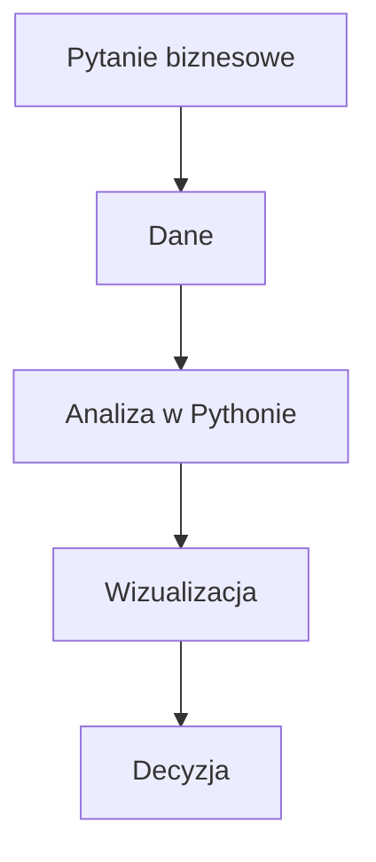

# S01 — Ćwiczenia laboratoryjne (zaoczne)

## Temat: Konfiguracja warsztatu + pierwsza eksploracja danych

**Programowanie w Pythonie II** | Spotkanie 1 — Laboratorium
**Czas:** 90 min | **Forma:** ćwiczenia praktyczne
**Uwaga:** Kontynuacja wykładu S01. Studenci widzieli narzędzia na żywo — teraz sami je konfigurują.

---

## Przydatne materiały

| Temat | Link |
|-------|------|
| Python — oficjalna strona | https://www.python.org/ |
| VS Code — Python Tutorial | https://code.visualstudio.com/docs/python/python-tutorial |
| Git — oficjalny podręcznik (po polsku) | https://git-scm.com/book/pl/v2 |
| uv — dokumentacja | https://docs.astral.sh/uv/ |
| Jupyter — dokumentacja | https://jupyter-notebook.readthedocs.io/en/stable/ |
| Pandas — 10 Minutes to Pandas | https://pandas.pydata.org/docs/user_guide/10min.html |

---

## Ćwiczenie 1: Instalacja Python, uv, VS Code, Git + konfiguracja (25 min)

### Cel
Zainstaluj i skonfiguruj narzędzia, z których będziesz korzystać przez cały semestr.

### Krok 1 — Python

**Windows (najpopularniejsze na zaocznych):**
1. Pobierz Python z https://www.python.org/downloads/
2. **WAŻNE:** Zaznacz "Add Python to PATH" przy instalacji
3. Otwórz PowerShell i sprawdź:
```powershell
python --version
```

**Linux (Ubuntu/Debian):**
```bash
sudo apt update && sudo apt install python3 python3-pip python3-venv
python3 --version
```

**macOS:**
```bash
brew install python
python3 --version
```

### Krok 2 — uv (menedżer pakietów)

**Linux/macOS:**
```bash
curl -LsSf https://astral.sh/uv/install.sh | sh
```

**Windows (PowerShell):**
```powershell
powershell -ExecutionPolicy ByPass -c "irm https://astral.sh/uv/install.ps1 | iex"
```

Zamknij i otwórz terminal ponownie, potem sprawdź:
```bash
uv --version
```

### Krok 3 — Git

**Windows:** Pobierz z https://git-scm.com/download/win (domyślne ustawienia).

**Linux:**
```bash
sudo apt install git
```

**macOS:**
```bash
brew install git
```

Sprawdź:
```bash
git --version
```

### Krok 4 — VS Code

1. Pobierz z https://code.visualstudio.com/
2. Zainstaluj
3. Otwórz VS Code i zainstaluj rozszerzenia (`Ctrl+Shift+X`):
   - **Python** (Microsoft)
   - **Jupyter** (Microsoft)
   - **GitLens** (GitKraken)

### Krok 5 — Konfiguracja Git (jednorazowo)

Otwórz terminal w VS Code (`` Ctrl+` ``):

```bash
git config --global user.name "Twoje Imię Nazwisko"
git config --global user.email "twoj.email@example.com"
```

### Sprawdzenie ✅

Uruchom w terminalu VS Code:
```bash
python --version        # lub python3 --version
uv --version
git --version
code --version
```

Wszystkie 4 komendy muszą zwrócić numer wersji. Jeśli coś nie działa — zgłoś prowadzącemu.

---

## Ćwiczenie 2: Git — repo, commit, push na GitHub (20 min)

### Cel
Stwórz repozytorium Git, wykonaj commit i wypchnij na GitHub. Udostępnij prowadzącemu.

### Krok 1 — Konto GitHub

Jeśli nie masz: wejdź na https://github.com -> **Sign up** -> załóż konto.

### Krok 2 — Utwórz lokalne repozytorium

```bash
mkdir python2-lab
cd python2-lab
git init
```

### Krok 3 — Pierwszy plik i commit

```bash
echo "# Moje laboratorium Python II" > README.md
git add README.md
git commit -m "Pierwszy commit — dodaj README"
```

**Co się stało:**
- `git init` — utworzył repozytorium (ukryty folder `.git/`)
- `git add` — dodał plik do staging area (poczekalni)
- `git commit -m "..."` — zapisał migawkę z opisem

### Krok 4 — Utwórz repo na GitHub i wypchnij

1. Na GitHub: kliknij **+** -> **New repository**
2. Nazwa: `python2-lab`, reszta domyślnie -> **Create repository**
3. W terminalu:

```bash
git remote add origin https://github.com/TWOJ-LOGIN/python2-lab.git
git push -u origin master
```

4. GitHub zapyta o logowanie:
   - Login: twój login GitHub
   - Hasło: potrzebujesz **token** (NIE zwykłe hasło!):
     - GitHub -> Settings -> Developer settings -> Personal access tokens -> Tokens (classic)
     - Generate new token -> zaznacz `repo` -> Generate -> skopiuj token
     - Wklej token zamiast hasła

### Krok 5 — Udostępnij prowadzącemu

**Opcja A (zalecane) — Repozytorium publiczne:**
Repo publiczne = prowadzący wchodzi i widzi.

**Opcja B — Repozytorium prywatne:**
1. Na GitHubie: otwórz repo -> **Settings** -> **Collaborators**
2. Kliknij **Add people**
3. Wpisz login: **sp6jaz**

### Sprawdzenie ✅

- Otwórz w przeglądarce: `https://github.com/TWOJ-LOGIN/python2-lab`
- Widzisz README.md? Repo działa!
- `git log --oneline` pokazuje twój commit
- Prowadzący (sp6jaz) ma dostęp

---

## Ćwiczenie 3: Markdown README.md + push (15 min)

### Cel
Napisz profesjonalne README.md w składni Markdown i wypchnij na GitHub.

### Krok 1 — Otwórz projekt w VS Code

```bash
code python2-lab
```

Lub: VS Code -> File -> Open Folder -> wybierz `python2-lab`

### Krok 2 — Edytuj README.md

Otwórz README.md w VS Code. Włącz podgląd: `Ctrl+Shift+V` (lub `Ctrl+K V` — podgląd obok kodu).

Zamień zawartość na:

```markdown
# Imię Nazwisko

## O mnie
Studiuję Analitykę danych w biznesie na Politechnice Opolskiej, semestr 2.

## Zainteresowania
- [wpisz coś]
- [wpisz coś]
- [wpisz coś]

## Umiejętności techniczne
| Narzędzie | Poziom |
|-----------|--------|
| Python    | początkujący / średni |
| Excel     | ... |
| SQL       | ... |

## Czego chcę się nauczyć
1. [wpisz cel]
2. [wpisz cel]
3. [wpisz cel]

## Mój workflow



## Kontakt
- GitHub: [twój login](https://github.com/twój-login)
```

### Krok 3 — Commituj i wypchnij

```bash
git add README.md
git commit -m "Rozbuduj README o opis osobisty i diagram"
git push
```

### Krok 4 — Sprawdź na GitHubie

Odśwież stronę repozytorium. README renderuje się pięknie — nagłówki, tabela, lista, diagram Mermaid.

### Sprawdzenie ✅

- README.md zawiera: nagłówki, listę, tabelę, diagram Mermaid
- Na GitHubie renderuje się poprawnie (diagram widoczny jako schemat)
- `git log --oneline` pokazuje minimum 2 commity
- Link do repo wysłany prowadzącemu (Moodle lub email)

---

## Ćwiczenie 4: venv + pakiety + hello_data.py (15 min)

### Cel
Stwórz środowisko wirtualne, zainstaluj pakiety i uruchom pierwszy skrypt z danymi.

### Krok 1 — Utwórz środowisko wirtualne

```bash
# Upewnij się, że jesteś w katalogu python2-lab
cd python2-lab
uv venv
```

### Krok 2 — Aktywuj środowisko

**Linux/macOS:**
```bash
source .venv/bin/activate
```

**Windows (PowerShell):**
```powershell
.venv\Scripts\Activate.ps1
```

Powinieneś zobaczyć `(.venv)` na początku wiersza poleceń.

### Krok 3 — Zainstaluj pakiety

```bash
uv pip install numpy pandas matplotlib jupyter
```

### Krok 4 — Dodaj .gitignore

Utwórz plik `.gitignore` w VS Code z zawartością:

```
.venv/
__pycache__/
*.pyc
.ipynb_checkpoints/
```

### Krok 5 — Napisz skrypt hello_data.py

Utwórz plik `hello_data.py` w VS Code:

```python
"""Mój pierwszy skrypt analizy danych."""
import numpy as np

dane = np.array([10, 20, 30, 40, 50])
print(f"Dane:    {dane}")
print(f"Średnia: {dane.mean():.1f}")
print(f"Suma:    {dane.sum()}")
print(f"Min:     {dane.min()}, Max: {dane.max()}")
print(f"Odch. std: {dane.std():.2f}")
```

Uruchom:
```bash
python hello_data.py
```

### Krok 6 — Utwórz strukturę folderów i commituj

```bash
mkdir -p lab01 lab02 lab03 lab04 lab05 lab06 lab07 lab08 lab09 lab10 projekt
mv hello_data.py lab01/
git add .gitignore lab01/hello_data.py
git commit -m "S01: środowisko wirtualne, gitignore, hello_data.py"
git push
```

### Sprawdzenie ✅

- Skrypt wyświetla: Średnia: 30.0, Suma: 150, Min: 10, Max: 50
- `(.venv)` widoczny w terminalu
- `.venv/` jest w `.gitignore` (NIE w repozytorium!)
- Na GitHubie widać `lab01/hello_data.py` i `.gitignore`, ale NIE `.venv/`

---

## Ćwiczenie 5: Jupyter Notebook — wczytaj dataset, explore, wykres (15 min)

### Cel
Uruchom Jupyter Notebook w VS Code, wczytaj prawdziwy dataset, zbadaj go i zrób wykres.

### Krok 1 — Utwórz notebook

W VS Code: `Ctrl+Shift+P` -> wpisz "Create New Jupyter Notebook" -> Enter

Wybierz kernel: kliknij "Select Kernel" -> Python Environments -> `.venv`

Zapisz jako `lab01/s01_eksploracja.ipynb` (`Ctrl+S`).

### Krok 2 — Komórka Markdown (nagłówek)

Zmień pierwszą komórkę na Markdown (`Esc` -> `M`) i wpisz:

```markdown
# S01 — Pierwsza eksploracja danych
**Autor:** [Twoje imię]
**Data:** [dzisiejsza data]

## Cel
Wczytanie datasetu tips i odpowiedź na pytania biznesowe.
```

Uruchom: `Shift+Enter`

### Krok 3 — Import i wczytanie danych

Nowa komórka Code:

```python
import pandas as pd
import matplotlib.pyplot as plt

df = pd.read_csv('https://raw.githubusercontent.com/mwaskom/seaborn-data/master/tips.csv')
print(f"Dane wczytane: {df.shape[0]} wierszy, {df.shape[1]} kolumn")
```

### Krok 4 — Poznaj dane

Każde polecenie w **osobnej komórce** (żeby widzieć wynik):

```python
df.head()
```

```python
df.describe()
```

```python
df.dtypes
```

### Krok 5 — Odpowiedz na pytania biznesowe

Dodaj komórkę Markdown: `## Pytania biznesowe`

**Pytanie 1:** Jaki był najwyższy rachunek?
```python
df['total_bill'].max()
```

**Pytanie 2:** Ile rachunków w każdym dniu tygodnia?
```python
df['day'].value_counts()
```

**Pytanie 3:** Średni napiwek wg dnia?
```python
df.groupby('day')['tip'].mean().sort_values(ascending=False)
```

### Krok 6 — Wykres

```python
df.groupby('day')['tip'].mean().plot(kind='bar', title='Średni napiwek wg dnia tygodnia')
plt.ylabel('Napiwek ($)')
plt.tight_layout()
plt.show()
```

### Krok 7 — Zapisz, Restart & Run All, commituj

1. W notebooku: Restart Kernel and Run All (żeby wyniki były widoczne)
2. `Ctrl+S`
3. W terminalu:

```bash
git add lab01/s01_eksploracja.ipynb
git commit -m "S01: eksploracja datasetu tips — notebook z wykresem"
git push
```

### Sprawdzenie ✅

- Notebook uruchamia się bez błędów (Restart & Run All przeszedł)
- Odpowiedzi: najwyższy rachunek = **50.81 $**, sobota = **87** rachunków, niedziela = najwyższy średni napiwek (**3.26 $**)
- Wykres słupkowy widoczny w notebooku
- Na GitHubie notebook renderuje się z kodem, wynikami i wykresem
- Kernel to Python z `.venv`

---

## Podsumowanie

Po dzisiejszym spotkaniu masz:
- Zainstalowane: Python, uv, VS Code, Git
- Konto na GitHub + repozytorium `python2-lab`
- Prowadzący (sp6jaz) ma dostęp do repo
- README.md z Markdown (nagłówki, tabela, diagram Mermaid)
- Środowisko wirtualne z pakietami (numpy, pandas, matplotlib)
- Działający skrypt `hello_data.py`
- Jupyter Notebook z eksploracja datasetu i wykresem
- Minimum 4 commity w historii

### Workflow na każde następne spotkanie

```
1. cd ~/python2-lab
2. source .venv/bin/activate   (Linux) / .venv\Scripts\Activate.ps1 (Windows)
3. code .
4. Pracuj w folderze labXX/
5. Commituj po KAŻDYM ćwiczeniu
6. git push na koniec zajęć
7. Sprawdź na GitHubie czy notebook się renderuje
```

### Na następnym spotkaniu
NumPy — szybkie obliczenia na tablicach danych. Fundament, na którym stoi Pandas i cała analiza danych.
