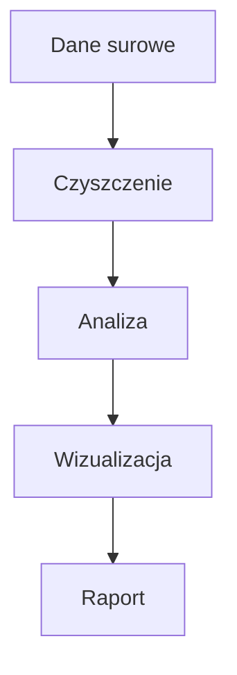

# S01 Wykład (zaoczne) — Plan zajęć dla prowadzącego

## Temat: Warsztat pracy analityka + pipeline analityczny

### Informacje organizacyjne
- **Czas:** 90 min (2h akademickie)
- **Forma:** wykład konwersatoryjny z live coding
- **Potrzebne:** komputer z projektorem, VS Code z Jupyter, terminal, internet
- **Uwaga:** Studia zaoczne — ta sama osoba prowadzi wykład i lab. Wykład przechodzi płynnie w ćwiczenia.
- **Zakres:** łączy treści W01 (warsztat pracy) i W02 (pipeline, Jupyter, typy danych) ze studiów dziennych

### Efekty uczenia się (Bloom)
Po tym wykładzie osoba studiująca:
1. **Wyjaśnia** rolę Git, GitHub, Markdown i venv w pracy analityka danych (Bloom 2)
2. **Opisuje** pipeline analityczny: pytanie -> dane -> analiza -> wizualizacja -> decyzja (Bloom 2)
3. **Identyfikuje** typy danych w Pythonie i DataFrame (int, float, str, object, datetime) (Bloom 1)
4. **Stosuje** Jupyter Notebook do eksploracji danych (Bloom 3)

### Plan minutowy

| Czas | Etap | Co robisz | Jak |
|------|------|-----------|-----|
| 0:00-0:05 | **WPROWADZENIE** | WOW demo (10 linii -> wykres) + przedstawienie | Live coding |
| 0:05-0:15 | **MATERIAŁ 1** | Organizacja kursu: KOP, ocenianie, narzędzia | Slajd/rozmowa |
| 0:15-0:30 | **MATERIAŁ 2** | Git i GitHub — workflow: add-commit-push, po co GitHub | Live coding |
| 0:30-0:40 | **MATERIAŁ 3** | Markdown + Mermaid — szybki pokaz | Live coding |
| 0:40-0:50 | **MATERIAŁ 4** | VS Code + uv + venv + Jupyter — demo w jednym bloku | Live demo |
| 0:50-1:00 | **MATERIAŁ 5** | Pipeline analityczny (dane -> czyszczenie -> analiza -> wizualizacja -> raport) | Notebook |
| 1:00-1:10 | **MATERIAŁ 6** | Typy danych w analizie (Pandas dtypes, problem NaN) | Live coding |
| 1:10-1:20 | **MATERIAŁ 7** | Jak pracować przez semestr (repo, commity, udostępnianie prowadzącemu sp6jaz) | Pokaz |
| 1:20-1:30 | **PODSUMOWANIE** | 3 bullet points + co robimy na laboratorium | Rozmowa |

---

## STENOGRAM — co mowic i robic

### 0:00-0:05 — WPROWADZENIE (WOW demo)

**[Otwórz VS Code z przygotowanym notebookiem — ten sam wow_demo.ipynb co dzienne]**

> "Dzień dobry, jestem dr hab. Jarosław Zygarlicki i prowadzę z wami Programowanie w Pythonie II. Zanim cokolwiek powiem — pokażę wam coś."

**[Uruchom notebook — 10 linii kodu, od CSV do wykresu]**

```python
import pandas as pd
import matplotlib.pyplot as plt

df = pd.read_csv('https://raw.githubusercontent.com/mwaskom/seaborn-data/master/tips.csv')
print(f"Dataset: {len(df)} wierszy, {len(df.columns)} kolumn")
print(df.head())
print(f"\nŚredni rachunek: {df['total_bill'].mean():.2f} $")
df.groupby('day')['total_bill'].mean().plot(kind='bar', title='Średni rachunek wg dnia tygodnia')
plt.ylabel('USD')
plt.tight_layout()
plt.savefig('wykres.png')
plt.show()
```

> "10 linii kodu. Wczytaliśmy dane z internetu, przeanalizowaliśmy je i zrobiliśmy wykres. Na końcu semestru będziecie robić takie rzeczy w śnie. Ale nie chodzi o sam kod — chodzi o **umiejętność opowiedzenia historii danymi**. Kierunek Analityka Danych w Biznesie oznacza jedno: zamieniacie surowe dane w **decyzje biznesowe**."

> "Dzisiaj zbudujemy warsztat pracy — narzędzia i proces — a potem od razu przejdziemy na lab, gdzie to wszystko sami skonfigurujecie."

---

### 0:05-0:15 — MATERIAŁ 1: Organizacja kursu

> "Kilka spraw organizacyjnych, szybko, bo czas jest cenny."

**[Pokaż KOP / slajd z informacjami]**

Omów zwięźle:
- **Przedmiot:** Programowanie w języku Python II, 5 ECTS
- **Forma (zaoczne):** 10 spotkań, każde = wykład (90 min) + lab (90 min), ta sama osoba prowadzi
- **Zaliczenie:** egzamin + cząstkowe zadania laboratoryjne (oddawane przez GitHub)
- **Materiały:** Moodle + repozytorium GitHub kursu

> "Ocenianie: na każdym spotkaniu robicie ćwiczenia na labie, oddajecie przez GitHub. Egzamin na koniec. Ale najważniejsze — **kurs jest praktyczny**. Nie chodzi o zapamiętanie składni, chodzi o rozwiązywanie problemów z danymi."

**Narzędzia kursu:**

| Narzędzie | Do czego |
|-----------|----------|
| Python 3.12+ | język |
| uv | pakiety i środowiska wirtualne |
| VS Code | edytor + Jupyter + Git |
| Git + GitHub | wersjonowanie, portfolio, oddawanie prac |

> "Dlaczego nie Anaconda? Jest ciężka, komercyjna, uczy ekosystemu, który nie istnieje w firmach. My pracujemy na narzędziach profesjonalistów."

---

### 0:15-0:30 — MATERIAŁ 2: Git i GitHub

> "Git to system kontroli wersji. W praktyce: koniec z plikami raport_v1, raport_final, raport_naprawde_final."

**[Otwórz terminal]**

> "Wyobraźcie sobie pliki: raport_v1.docx, raport_final.docx, raport_naprawde_final.docx... Git rozwiązuje ten problem: jeden plik, Git pamięta każdą wersję."

**[Live demo — pisz powoli, komentuj]**

```bash
mkdir demo-projekt
cd demo-projekt
git init
echo "# Mój projekt" > README.md
git add README.md
git commit -m "Pierwszy commit"
```

> "Trzy kroki workflow: **add** — co chcesz zapisać, **commit** — migawka z opisem, **push** — wyślij na GitHub."

> "GitHub to jak Dysk Google dla kodu. Wasz kod jest w chmurze, możecie go udostępnić. Co najważniejsze — **to wasze portfolio**. Pracodawca wchodzi na wasz GitHub i widzi co potraficie."

**[Pokaż swój profil GitHub]**

> "Na labie za chwilę założycie konta, stworzycie repo i wypchnięcie pierwszy projekt."

Kluczowe pojęcia do podkreślenia:
- **add** — staging area (co idzie do commitu)
- **commit** — migawka z wiadomością (co i dlaczego)
- **push** — wysyłka na zdalny serwer (GitHub)
- **clone** — pobranie czyjegoś repo

---

### 0:30-0:40 — MATERIAŁ 3: Markdown + Mermaid

> "Skoro mamy Git i GitHub — potrzebujemy dokumentacji. Nie Word, nie PDF — **Markdown**."

**[Otwórz VS Code, nowy plik demo.md, włącz podgląd Ctrl+Shift+V]**

**[Pisz na żywo — szybko, konkretnie]**

```markdown
# Nagłówek
## Podtytuł

**Pogrubienie** i *kursywa*.

Lista:
- punkt 1
- punkt 2

Kod: `print("hello")`

| Kolumna A | Kolumna B |
|-----------|-----------|
| wartość 1 | wartość 2 |
```

> "Zwykły tekst, a na GitHubie wygląda profesjonalnie. README.md — wizytówka każdego repozytorium."

**[Mermaid — szybki pokaz]**

````markdown

````

> "Diagram w 5 linijkach tekstu. GitHub renderuje go automatycznie. Żaden PowerPoint — tekst, który Git śledzi."

---

### 0:40-0:50 — MATERIAŁ 4: VS Code + uv + venv + Jupyter (demo)

> "Teraz szybko pokażę narzędzia — na labie sami je zainstalujecie."

**[VS Code]**

> "VS Code — darmowy edytor od Microsoftu. Terminal, Git, Jupyter — wszystko w jednym oknie."

**[Pokaż: terminal, Git panel, extensions]**

> "Trzy rozszerzenia do zainstalowania: Python, Jupyter, GitLens."

**[Terminal — venv]**

```bash
uv venv
source .venv/bin/activate    # Linux
# .venv\Scripts\Activate.ps1  # Windows
uv pip install numpy pandas matplotlib
```

> "uv — ultraszybki menedżer pakietów, napisany w Rust. Środowisko wirtualne izoluje biblioteki — projekt A nie koliduje z projektem B."

> "Zasada: **venv NIE idzie do Gita**. Do Gita idzie requirements.txt — lista bibliotek."

**[Jupyter — szybkie demo]**

> "Jupyter Notebook znacie z Colaba — to to samo, ale lokalne. Komórki Code i Markdown. Shift+Enter uruchamia komórkę."

**[Ctrl+Shift+P -> "Create New Jupyter Notebook" -> pokaż 2 komórki]**

```python
2 + 2
```

```python
import numpy as np
dane = np.array([10, 20, 30, 40, 50])
print(f"Średnia: {dane.mean()}")
```

> "Notebook to nie skrypt — to **narracja z kodem**. Piszesz co robisz, dlaczego i jakie wnioski."

---

### 0:50-1:00 — MATERIAŁ 5: Pipeline analityczny

> "Mamy narzędzia. Teraz — **jak wygląda praca analityka od początku do końca?**"

**[Narysuj na tablicy lub pokaż diagram]**

```
Pytanie biznesowe -> Pozyskanie danych -> Czyszczenie -> Analiza -> Wizualizacja -> Decyzja
```

> "Pipeline analityczny. Brzmi groźnie, a to po prostu sekwencja kroków. Pokażę na przykładzie."

> "Scenariusz: pracujesz w restauracji. Szef pyta: **'Który dzień tygodnia przynosi największe napiwki?'** — bo chce wiedzieć kiedy zatrudnić więcej kelnerów."

**[Wróć do notebooka z WOW demo lub otwórz nowy]**

```python
import pandas as pd
import matplotlib.pyplot as plt

# Krok 1: Pozyskanie danych
df = pd.read_csv('https://raw.githubusercontent.com/mwaskom/seaborn-data/master/tips.csv')

# Krok 2: Poznaj dane
print(f"Rozmiar: {df.shape}")
df.head()
```

```python
# Krok 3: Analiza — odpowiedź na pytanie
df.groupby('day')['tip'].mean().sort_values(ascending=False)
```

> "Niedziela — średni napiwek 3.26 $. Sobota na drugim miejscu. Szef wie kiedy potrzebuje więcej kelnerów."

```python
# Krok 4: Wizualizacja — dla szefa
df.groupby('day')['tip'].mean().plot(kind='bar', title='Średni napiwek wg dnia')
plt.ylabel('USD')
plt.tight_layout()
plt.show()
```

> "Dane w tabelce są dobre dla analityka, ale szef chce **obrazek**. Decyzja biznesowa zapada na podstawie wykresu."

> "To jest cały pipeline: **pytanie -> dane -> przejrzenie -> analiza -> wykres -> odpowiedź**. Przez następne spotkania będziemy doskonalić każdy z tych kroków."

---

### 1:00-1:10 — MATERIAŁ 6: Typy danych w analizie

> "Szybka powtórka z Pythona I — ale w kontekście danych biznesowych."

```python
# Typy Pythona
cena = 19.99           # float
ilosc = 42             # int
produkt = "Laptop"     # str
w_magazynie = True     # bool
```

> "To znacie. Ale w analizie danych pojawia się nowy problem:"

```python
# Problem: brakujące dane — codzienność analityka
dane_hr = [
    {"imie": "Anna", "pensja": 8500, "dzial": "IT"},
    {"imie": "Jan", "pensja": None, "dzial": "HR"},      # brak pensji!
    {"imie": "Ewa", "pensja": 7200, "dzial": None},      # brak działu!
]
```

> "W realnych danych **zawsze** czegoś brakuje. Klient nie podał adresu, sensor nie zapisał pomiaru. Listy i słowniki nie radzą sobie z tym. Pandas — radzi."

**[Pokaż typy w DataFrame]**

```python
print(df.dtypes)
```

> "DataFrame ma swoje typy: float64, int64, object. Pandas rozpoznaje typ przy wczytaniu."

```python
# Kluczowe typy Pandas
# float64   — kwoty, ceny, pomiary
# int64     — ilości, identyfikatory
# object    — nazwy, kategorie, opisy
# bool      — flagi (aktywny/nieaktywny)
# datetime64 — daty i czasy (dojdzie później)
```

> "NaN — Not a Number. Tak Pandas oznacza brakujące wartości. Nie None, nie 0 — NaN. Nauczycie się z tym pracować na spotkaniu o czyszczeniu danych."

---

### 1:10-1:20 — MATERIAŁ 7: Jak pracować przez semestr

> "Zanim przejdziemy na lab — pokażę wam workflow na cały semestr."

> "Przez cały semestr pracujecie w JEDNYM repozytorium na GitHubie."

```
python2-lab/
├── README.md          <- wasza wizytówka
├── .gitignore
├── lab01/             <- folder na każde spotkanie
├── lab02/
├── ...
└── projekt/           <- mini-projekt pod koniec
```

> "Workflow na każdych zajęciach: otwierasz VS Code, aktywujesz venv, pracujesz w folderze labXX, **commitujesz po KAŻDYM ćwiczeniu** — nie na koniec! — i pushesz na GitHub."

> "Dlaczego commity po każdym ćwiczeniu? Bo ja widzę waszą historię. Jeden commit z wszystkim na koniec = 'student skopiował'. Pięć commitów = 'student pracował'. Różnica w ocenie."

> "Ja mam wgląd do waszych repozytoriów. Publiczne — wchodzę i widzę. Prywatne — dodajecie mnie jako collaboratora. Mój login: **sp6jaz**."

> "Notebooki przed commitem: **Restart & Run All** — żeby wyniki były widoczne. GitHub renderuje .ipynb — widzę kod, wyniki i wykresy w przeglądarce."

---

### 1:17-1:20 — AKTYWNOŚĆ — Mini-quiz (3 min)

> **Prowadzący mówi:** "Zanim podsumujemy — szybki quiz. Odpowiedzcie na kartce lub w parach."

1. Jakie trzy kroki ma workflow Gita? (add → ??? → push)
2. Czym różni się `uv venv` od `pip install`? (podpowiedź: izolacja)
3. Wymień 3 etapy pipeline'u analitycznego (od danych surowych do decyzji).

> **[Po 2 min]** "Kto chce odpowiedzieć? [Omów odpowiedzi: 1) add-commit-push, 2) uv venv tworzy środowisko wirtualne — izolacja pakietów, pip install instaluje pakiet, 3) np. pozyskanie → czyszczenie → analiza → wizualizacja → decyzja]"

---

### 1:20-1:30 — PODSUMOWANIE

> "Podsumujmy. Dzisiaj omówiliśmy dwa tematy:"

> "**Temat 1 — Warsztat pracy:** Git, GitHub, Markdown, VS Code, uv, venv, Jupyter. To narzędzia, z których korzysta każdy profesjonalny analityk."

> "**Temat 2 — Pipeline analityczny:** od pytania biznesowego, przez dane, analizę, wizualizację, do decyzji. Plus typy danych i problem brakujących wartości."

> "**Trzy rzeczy do zapamiętania:**"
> "1. Git + GitHub — wersjonowanie i portfolio"
> "2. Pipeline: pytanie -> dane -> analiza -> wykres -> decyzja"
> "3. W realnych danych zawsze czegoś brakuje — Pandas to ogarnia"

> "A teraz przechodzimy na **laboratorium**. Zainstalujecie narzędzia, stworzycie repo, wypchnięcie na GitHub, a na koniec wczytacie prawdziwy dataset i zrobicie wykres. Róbmy to."
